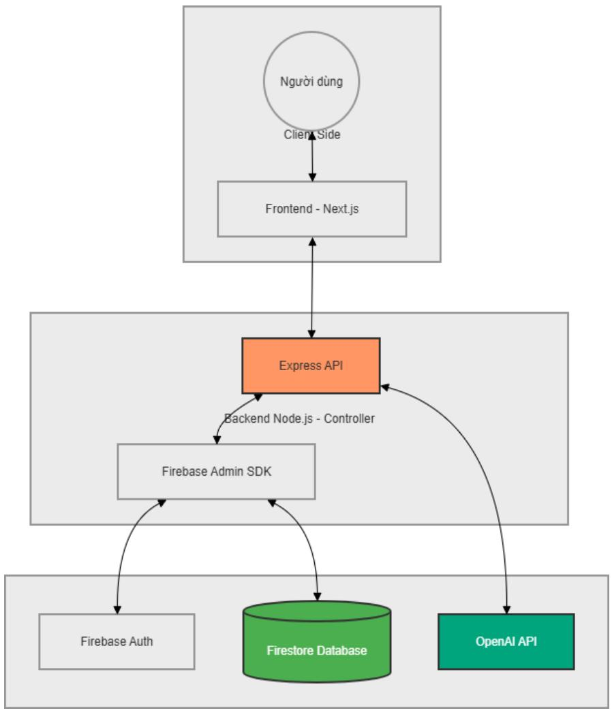
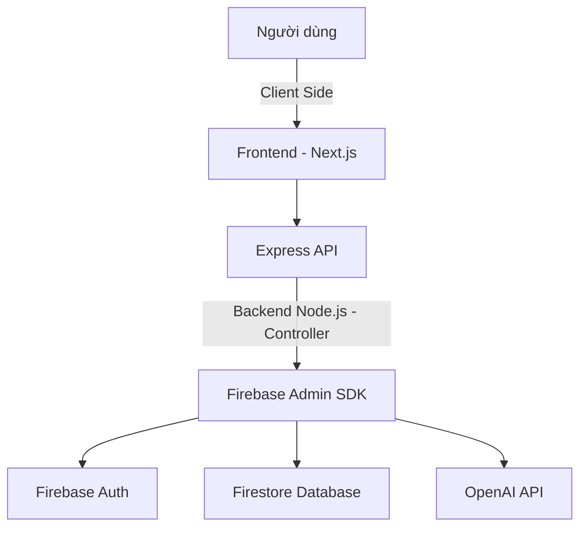
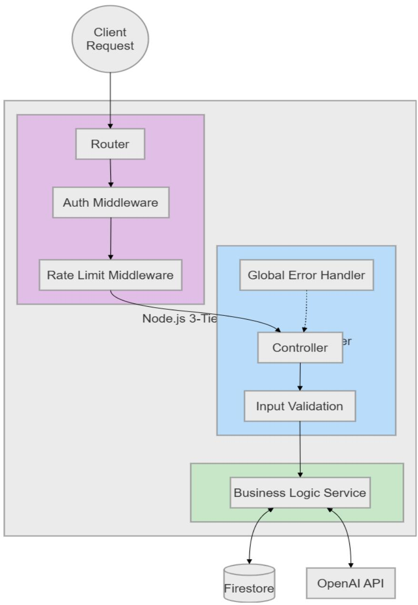
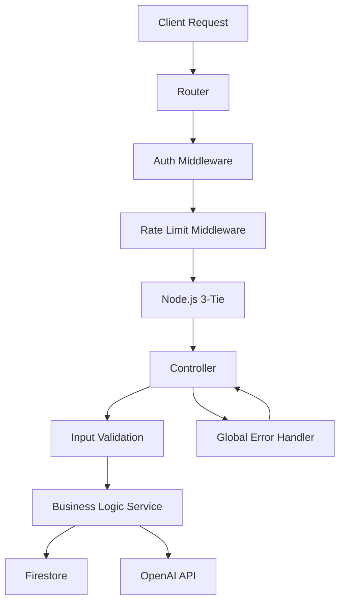
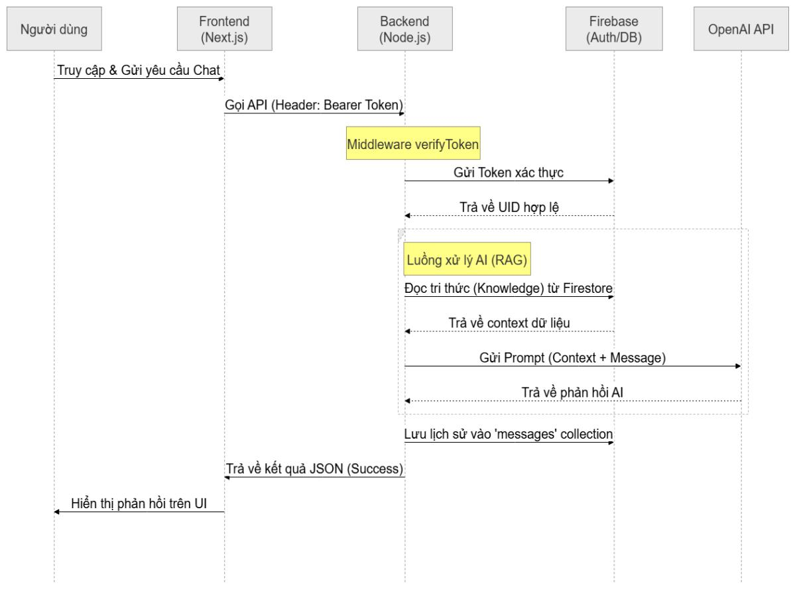
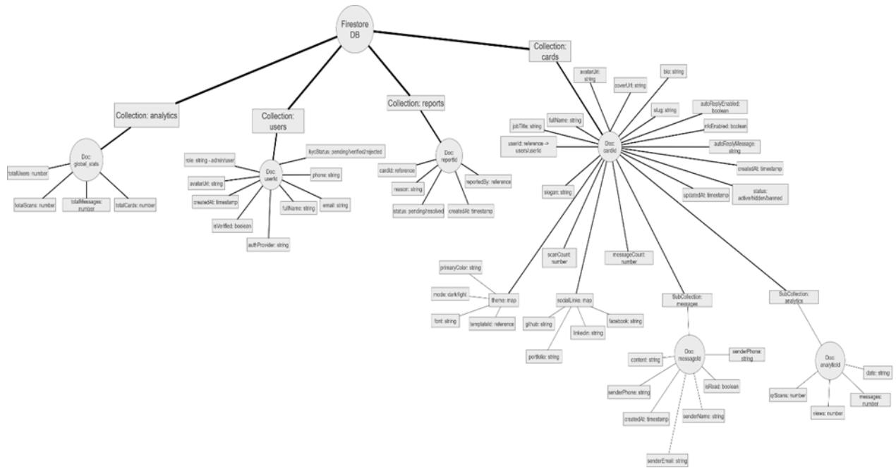
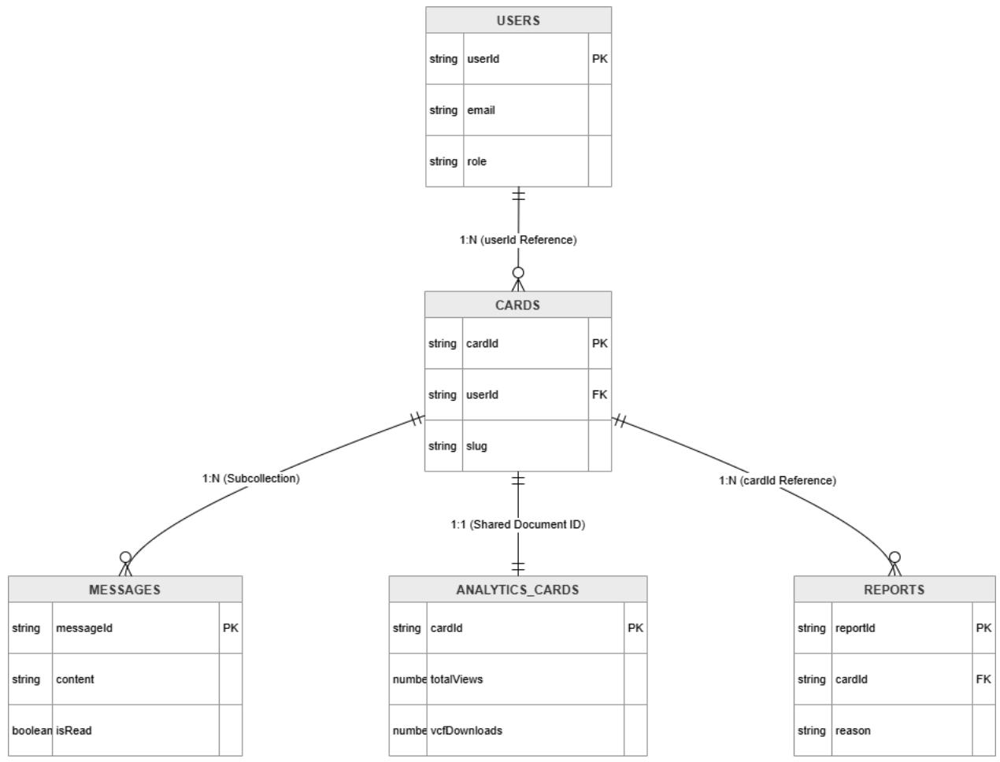
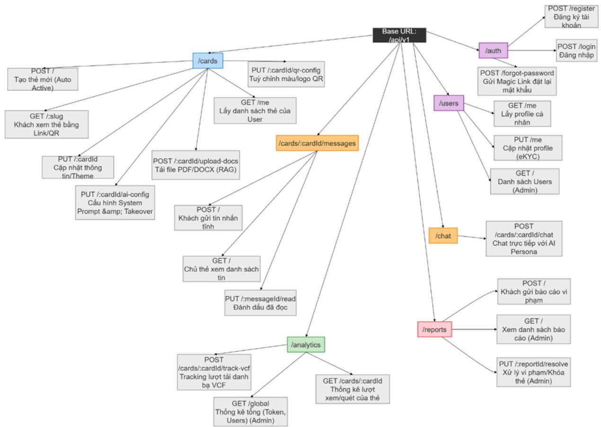

# ĐẠI HỌC SÀI GÒN

# KHOA CÔNG NGHỆ THÔNG TIN

# ARTCHITECT & DATABSE

# PERSONA-BASED WEBSITE FOR DIGITAL TWIN CARD

Học phần: Seminar Chuyên Đề

GVHD: TS. Đỗ Như Tài

Lớp: DCT122C3

Nhóm sinh viên thực hiện - Nhóm 1:

<table><tr><td>STT</td><td>Họ và tên</td><td>MSSV</td></tr><tr><td>1</td><td>Châu Gia Anh</td><td>3122411002</td></tr><tr><td>2</td><td>Dương Lê Khánh</td><td>3122411093</td></tr><tr><td>3</td><td>Phan Thành Đại</td><td>3122411036</td></tr><tr><td>4</td><td>Đào Thị Thanh Tâm</td><td>3122411182</td></tr></table>

THÀNH PHỐ HỒ CHÍ MINH

# MỤC LỤC

# DANH MỤC CÁC KÝ HIỆU, CHỮ VIẾT TẮT..

# 1. Giới thiệu.....

1.1. Mục đích tài liệu..   
1.2. Phạm vi tài liệu..   
1.3. Công nghệ Stack được sử dụng.   
1.4. Giả định và ràng buộc. 5

# 2. Tổng quan Kiến trúc Hệ thống (High-level Architecture).................. .... 6

2.1. Kiến trúc tổng thể (System Overview Diagram).. .6   
2.2. Các tầng trong hệ thống (Layered Architecture).. .6   
2.3. Data Flow Diagram (User → Frontend → Backend → Firebase → AI)...........7   
2.4. Realtime Architecture. 8

# 3. Thành phần Hệ thống (System Components)... 8

3.1. Frontend (Next.js 15).. 8   
3.2. Backend API (Node.js + Express.js). 8   
3.3. Authentication Service (Firebase Auth).. 9   
3.4. Database (Firebase Cloud Firestore).   
3.5. File Storage (Firebase Cloud Storage)..   
3.6. AI Service (OpenRouter / OpenAI).. 9   
3.7. External Services (QR Code Generator, Analytics…)... 9

# 4. Thiết kế Database - Firebase Cloud Firestore....

4.1. Nguyên tắc thiết kế Firestore.. 9   
4.2. Cấu trúc Collections & Documents.. .13   
4.3. Chi tiết các Collection chính.. . 13

# 5. Data Models & Schemas.... 13

5.1. User Model.. .13   
5.2. Digital Card Model.. .14   
5.3. Reports.. 15   
5.4. Conversation & Message Model.. .15   
5.5 Ai\_knowledge\_base.. . 15   
5.6 Analytics\_cards.. 15

5.7. Relationship giữa các Collection (Subcollections & References).. 16

5.7.1 Mối quan hệ giữa users và cards (Quan hệ 1 — Nhiều). .16   
5.7.2 Mối quan hệ giữa cards và messages (Quan hệ 1 — Nhiều phân cấp).....18   
5.7.3 Mối quan hệ giữa cards và messages (Quan hệ 1 — Nhiều phân cấp).....18   
5.7.4 Mối quan hệ giữa cards và reports (Quan hệ 1 — Nhiều).. . 18

# 6. Authentication & Authorization.. 19

6.1. Firebase Auth Integration. .19

6.2. Custom Claims & Roles (Card Owner, Admin).. .19   
6.3. Security Rules cho Firestore.. 19   
6.4. JWT / Session Management. . 19

# 7. API Design (Backend - Node.js Express)......... ..20

7.1. API Architecture Overview.. .20   
7.2. Route Organization.. . 22   
7.3. Các API chính (Auth, Cards, Chat, Inbox, QR…).. .. 22   
7.4. Middleware (Auth, Rate Limiting, Error Handling). . 23   
7.5. OpenAI Integration Flow.. . 23

# 8. Tích hợp AI Digital Twin.. . 23

8.1. Kiến trúc AI Prompting.. ..23   
8.2. Knowledge Base Generation (persona\_data.json).. . 23   
8.3. System Prompt + Guardrails.. . 23   
8.4. Human Takeover Mechanism. ..23   
8.5. Fallback Strategy khi AI lỗi. . 24

# 9. Realtime Features...... . 24

9.1. Realtime Chat (Firestore + Client SDK).. . 24   
9.2. Inbox realtime cho chủ thẻ. . 24   
9.3. Notification (Email + In-app).. ..24

# 10. File Storage Architecture... . 24

10.1. Firebase Cloud Storage Structure. ..24   
10.2. Avatar, Cover Image, QR Code. ..24   
10.3. Security Rules & Access Control. ..24

# 11. Security & Data Protection. . 24

11.1. Firestore Security Rules chi tiết. . 24   
11.2. Rate Limiting & Anti-Spam. . 25   
11.3. Data Privacy & Consent.. . 25   
11.4. Input Sanitization & Validation.. .. 25

# 12. Performance & Scaling...... . 25

12.1. Firestore Indexing Strategy.. . 25   
12.2. Query Optimization.. .. 25   
12.3. Caching Strategy.. . 25   
12.4. Cost Optimization (Firestore + OpenAI).. . 25

# 14. Rủi ro Kiến trúc & Mitigation.... ..26

# 15. Phụ lục..... .. 26

DANH MỤC CÁC KÝ HIỆU, CHỮ VIẾT TẮT 

<table><tr><td>Từ viết tắt / Thuật ngữ</td><td>Ý nghĩa / Định nghĩa đầy đủ</td><td>Mô tả trong hệ thống Persona Digital Card</td></tr><tr><td>API</td><td>Application Programming Interface</td><td>Giao diện lập trình ứng dụng, dùng để kết nối Frontend và Backend.</td></tr><tr><td>BaaS</td><td>Backend as a Service</td><td>Dịch vụ phía máy chủ được cung cấp sẵn (trong dự án này là Firebase).</td></tr><tr><td>JWT</td><td>JSON Web Token</td><td>Chuẩn mã hóa dùng để xác thực người dùng thông qua mã Token.</td></tr><tr><td>Firestore</td><td>Google Cloud Firestore</td><td>Cơ sở dữ liệu NoSQL dạng tài liệu được sử dụng để lưu trữ data chính.</td></tr><tr><td>SDK</td><td>Software Development Kit</td><td>Bộ công cụ phát triển phần mềm (Firebase Admin SDK) dùng trên Backend.</td></tr><tr><td>CRUD</td><td>Create, Read, Update, Delete</td><td>4 thao tác cơ bản với dữ liệu (Tạo, Đọc, Cập nhật, Xóa).</td></tr><tr><td>Middleware</td><td>Phần mềm trung gian</td><td>Các hàm kiểm tra trung gian (Xác thực Token, Phân quyền Admin, Chống Spam).</td></tr><tr><td>RAG</td><td>Retrieval-Augmented Generation</td><td>Cơ chế lấy tri thức từ Database để bổ trợ cho AI trả lời chính xác hơn.</td></tr><tr><td>LLM</td><td>Large Language Model</td><td>Mô hình ngôn ngữ lớn (OpenAI GPT-4o-mini) đóng vai trò bộ não cho AI.</td></tr><tr><td>Slug</td><td>Friendly URL Identifier</td><td>Chuỗi ký tự định danh duy nhất trong URL (Ví dụ: persona.com/@dai-phan).</td></tr><tr><td>eKYC</td><td>Electronic Know Your Customer</td><td>Định danh khách hàng điện tử (Trạng thái xác thực thông tin người dùng).</td></tr><tr><td>Rate Limit</td><td>Giới hạn lưu lượng</td><td>Cơ chế chặn các hành vi spam hoặc tấn công DoS vào hệ thống API.</td></tr><tr><td>Digital Twin</td><td>Bản sao kỹ thuật số</td><td>Trợ lý ảo AI đại diện cho thông tin và tính cách của chủ thể.</td></tr><tr><td>Takeover</td><td>Human Takeover</td><td>Tính năng tạm dùng AI để người dùng trực tiếp xử lý tương tác.</td></tr><tr><td>JSON</td><td>JavaScript Object Notation</td><td>Định dạng trao đổi dữ liệu tiêu chuẩn giữa Client và Server.</td></tr><tr><td>RESTful</td><td>Representational State Transfer</td><td>Kiểu kiến trúc xây dựng API dựa trên các phương thức HTTP tiêu chuẩn.</td></tr><tr><td>vCard (VCF)</td><td>Virtual Contact File</td><td>Định dạng file danh bạ điện tử dùng để lưu thông tin vào điện thoại.</td></tr></table>

# 1. Giới thiệu

Dự án: Persona Digital Card (Hệ thống Thẻ Danh thiếp Thông minh Tích hợp Trợ lý Đối tượng: Khách hàng (Client/Stakeholders), Đội ngũ Phát triển, QA/QC và Hệ thống Quản trị.

# 1.1. Mục đích tài liệu

Tài liệu này đóng vai trò là "Source of Truth" (Nguồn chân lý), quy định và mô tả chi tiết toàn bộ kiến trúc tổng thể, cơ sở dữ liệu, luồng xử lý dữ liệu và tiêu chuẩn bảo mật cho dự án Persona Digital Card. Nó cung cấp cơ sở vững chắc cho các quyết định kỹ thuật, phát triển, triển khai và bảo trì.

# 1.2. Phạm vi tài liệu

Tài liệu bao phủ toàn bộ thiết kế kiến trúc Backend (Node.js), cấu trúc dữ liệu trên Firestore, tích hợp dịch vụ bên thứ ba (Firebase Auth, Cloud Storage, OpenAI API) và các cơ chế tương tác thời gian thực, bảo mật hệ thống.

# 1.3. Công nghệ Stack được sử dụng

Runtime: Node.js

Framework REST API: Express.js

Cơ sở dữ liệu: Firebase Cloud Firestore (NoSQL)

Xác thực: Firebase Authentication (JWT)

Lưu trữ file: Firebase Cloud Storage

Bộ não AI: OpenAI API (Model gpt-4o-mini)

Giao diện người dùng: Next.js 15 (Frontend)

# 1.4. Giả định và ràng buộc

- Hệ thống yêu cầu kết nối Internet liên tục để xử lý AI và làm mới dữ liệu realtime.   
- Firestore áp dụng hạn mức query và cấu trúc NoSQL nên cần cấu trúc schema khử chuẩn hoá (denormalized) một phần để tối ưu tốc độ đọc.   
- Chat AI tiêu tốn token và chi phí lớn nên bắt buộc áp dụng Rate Limiter khắt khe.

# 2. Tổng quan Kiến trúc Hệ thống (High-level Architecture)

# 2.1. Kiến trúc tổng thể (System Overview Diagram)

Persona Digital Card tuân theo mô hình Client-Server kết hợp BaaS (Backend-as-a-Service) từ Firebase. Backend Node.js đóng vai trò "người phán xử" (Controller), xử lý logic phức tạp, gọi AI và điều tiết quyền truy cập Firestore thông qua Firebase Admin SDK



<details>
<summary>flowchart</summary>


</details>

# 2.2. Các tầng trong hệ thống (Layered Architecture)

Backend Node.js tuân thủ nghiêm ngặt Kiến trúc 3 Lớp (3-Tier Structure):

1. Routes Layer (Tầng Điều hướng): Nhận request, gắn Middleware xác thực/giới hạn lưu lượng, chuyển tiếp tới Controller.   
2. Controller Layer (Tầng Kiểm soát): Xử lý input (validation), điều phối luồng từ Service, gom lỗi bằng Global Error Handler và chuẩn hoá kết quả JSON trả về cho Client.   
3. Service Layer (Tầng Nghiệp vụ): Chứa logic nghiệp vụ lõi (Business Logic), tương tác trực tiếp với Database (Firestore) và các External API (OpenAI).



<details>
<summary>flowchart</summary>


</details>

# 2.3. Data Flow Diagram (User → Frontend → Backend → Firebase → AI)

- User truy cập Frontend (Next.js) -> Gọi API Backend (Node.js) mang kèm Bearer Token (Firebase JWT).   
- Backend phân giải token với Firebase Auth. Nếu hợp lệ, hệ thống thao tác với Firestore.   
- Khi có request chat với bản sao số, Backend đọc ngữ cảnh (Knowledge) từ DB, gửi Prompt chuẩn tới OpenAI, nhận phản hồi, lưu lịch sử xuống messages collection và trả về cho Frontend.



<details>
<summary>flowchart</summary>

```mermaid
graph TD
    A["Người dùng"] -->|Truy cập & gửi yêu cầu Chat| B["Frontend (Next.js)"]
    B -->|Gọi API (Header: Bearer Token)| C["Backend (Node.js)"]
    C -->|Middleware verifyToken| D["Firebase (Auth/DB)"]
    D -->|Trả về UID hợp lệ| E["OpenAI API"]
    E -->|Trả về phàn hồi AI| F["Lường xử lý AI (RAG)"]
    F -->|Trả về context dữ liệu| G["Gửi Prompt (Context + Message)"]
    G -->|Trả về context dữ liệu| H["Đọc tri thức (Knowledge) từ Firestore"]
    H -->|Trả về context dữ liệu| I["Trả về kết quả JSON (Success)"]
    I -->|Hiển thị phần hồi trên UI| J["Trả về kết quả JSON (Success)"]
```
</details>

# 2.4. Realtime Architecture

Hệ thống sử dụng khả năng realtime (Snapshot listeners) của Firestore Client SDK ở frontend để lắng nghe các thay đổi hộp thư (Inbox) và lịch sử Chat mà không cần Backend phải duy trì Socket.io/WebSocket riêng rẽ, giúp giảm tải cực lớn cho Node.js server.

# 3. Thành phần Hệ thống (System Components)

# 3.1. Frontend (Next.js 15)

Ứng dụng SSR/SSG (Server-Side/Static Generation) giúp tối ưu hoá SEO (cho link thẻ cá nhân public) và tăng tốc độ tải. Giao tiếp với Backend qua RESTful API.

# 3.2. Backend API (Node.js + Express.js)

Ứng dụng Express gọn nhẹ, stateless, dễ dàng scale on-demand (Ví dụ khi dùng Google Cloud Run hoặc App Engine). Đảm nhiệm chuẩn hóa dữ liệu, bảo mật AI Guardrails và bảo vệ lạm dụng API.

# 3.3. Authentication Service (Firebase Auth)

Xử lý đăng ký, đăng nhập (Email/Password, Google). Cấp phát JWT Access Token và quản lý phiên.

# 3.4. Database (Firebase Cloud Firestore)

BaaS lưu trữ NoSQL theo cấu trúc Collection/Document chuyên phục vụ truy xuất tốc độ cao (sub-100ms).

# 3.5. File Storage (Firebase Cloud Storage)

Bucket lưu trữ Avatar, Ảnh Cover, QR code trả về URL dùng qua Firebase CDN.

# 3.6. AI Service (OpenRouter / OpenAI)

LLM Engine cung cấp khả năng xử lý ngôn ngữ tự nhiên. Persona Digital Card "tiêm" tri thức của chủ thẻ vào hệ thống nhắc nhở (System Prompt) nhằm tạo ra trợ lý ảo mang phong cách riêng của từng người.

# 3.7. External Services (QR Code Generator, Analytics…)

Sử dụng thư viện tạo QR Code nội bộ để render thẻ cứng vCard (NFC/QR) cho truy cập vật lý.

# 4. Thiết kế Database - Firebase Cloud Firestore

# 4.1. Nguyên tắc thiết kế Firestore

\- Cơ sở dữ liệu phi quan hệ (NoSQL). Tuân theo nguyên tắc "Dữ liệu được đọc cùng nhau sẽ được lưu cùng nhau".

\- Sử dụng Referencing (ID) giữa Users và Cards, nhưng lồng (Nested Object) các tùy chỉnh AI (aiConfig) thẳng vào thẻ để tối ưu số lần đọc document.

```mermaid
graph TD
    A["Firestore DB"] --> B["Collection: analytics"]
    A --> C["Collection: users"]
    A --> D["Collection: reports"]
    A --> E["Collection: cards"]
    B --> F["Doc: global scale"]
    B --> G["Doc: user"]
    C --> H["Doc: report"]
    D --> I["Doc: card"]
    E --> J["Doc: analytic"]
    F --> K["totalUsers: number"]
    F --> L["tableScans: number"]
    F --> M["TotalMessages: number"]
    F --> N["linkCards: number"]
    G --> O["role string - administrator"]
    G --> P["avatarUt: string"]
    G --> Q["mreadAtt: timestamp"]
    G --> R["verified Boolean"]
    G --> S["autProvider: string"]
    H --> T["jyStatus: sending/verified/rejected"]
    H --> U["phone: string"]
    H --> V["fullName: string"]
    H --> W["email: string"]
    I --> X["cardid: reference"]
    I --> Y["nusion: string"]
    I --> Z["status: pending/resolved"]
    I --> AA["createdAtt: timestamp"]
    E --> AB["jobTitle: string"]
    E --> AC["userId: reference->userUserIs"]
    E --> AD["journal: string"]
    E --> AE["jolog: string"]
    E --> AF["signarCount: number"]
    E --> AG["messageCount: number"]
    E --> AH["subject: string"]
    E --> AI["node: darklight"]
    E --> AJ["theme: map"]
    E --> AK["font: string"]
    E --> AL["template: reference"]
    E --> AM["github: string"]
    E --> AN["linglndn: string"]
    E --> AO["portfolio: string"]
    E --> AP["Seduction: string"]
    E --> AQ["Seduction: messages"]
    E --> AR["Seduction: analytics"]
    AF --> AS["Seduction: messageId"]
    AG --> AT["Seduction: messageId"]
    AH --> AU["Seduction: messageId"]
    AI --> AV["Seduction: messageId"]
    AJ --> AW["Seduction: messageId"]
    AK --> AX["Seduction: messageId"]
    AL --> AY["Seduction: messageId"]
    AM --> AZ["Seduction: messageId"]
    AN --> BA["Seduction: messageId"]
    AO --> BB["Seduction: messageId"]
    AP --> BC["Seduction: messageId"]
    AQ --> BD["Seduction: messageId"]
    AR --> BE["Seduction: messageId"]
```



<details>
<summary>flowchart</summary>


</details>

Để ra được ảnh trên ta bao quát lại PRD, dùng mermaid trên draw để phác họa Database tree

# DÙNG MERMAID TRÊN DRAW.IO

mindmap

root((Firestore DB))

Users\_Collection[Collection: users]

User\_Doc((Doc: userId))

u1[email: string]

u2[phone: string]

u3[fullName: string]

u4[role: string - admin/user]

u5[authProvider: string]

u6[isVerified: boolean]

u7[avatarUrl: string]

u8[kycStatus: pending/verified/rejected]

u9[status: active/banned]

u10[createdAt: timestamp]

Cards\_Collection[Collection: cards]

Card\_Doc((Doc: cardId))

c1[userId: reference]

c2[slug: string]

c3[fullName: string]

c4[jobTitle: string]

c5[slogan: string]

c6[bio: string]

c7[status: active/hidden/deleted]

c8[isPhonePublic: boolean]

c9[isEmailPublic: boolean]

c10[createdAt: timestamp]

c11[deletedAt: timestamp]

c12[avatarUrl: string]

c13[coverUrl: string]

Theme\_Object[theme: map]

t1[templateId: reference]

t2[primaryColor: string]

t3[font: string]

t4[mode: dark/light]

AI\_Config[aiConfig: map]

ac1[aiStatus: Ready/Disabled/Error]

ac2[systemPrompt: string]

ac3[knowledgeData: map]

ac4[toneOfVoice: string]

ac5[isAiPaused: boolean]

SocialLinks\_Object[socialLinks: array of objects]

s1[platform: string]

s2[url: string]

Messages\_SubCollection[SubCollection: messages]

Msg\_Doc((Doc: messageId))

m1[cardId: reference]

m2[senderName: string]

m3[senderEmail: string]

m4[senderPhone: string]

m5[content: string]

m6[isRead: boolean]

m7[isDeleted: boolean]

m8[createdAt: timestamp]

Reports\_Collection[Collection: reports]

Report\_Doc((Doc: reportId))

r1[cardId: reference]

r2[reporterEmail: string]

r3[reason: string]

r4[status: pending/resolved]

r5[createdAt: timestamp]

Analytics\_Collection[Collection: analytics\_cards]

Analytic\_Doc((Doc: cardId))

a1[totalViews: number]

a2[vcfDownloads: number]

a3[aiChatInteractions: number]

a4[lastUpdated: timestamp]

# 4.2. Cấu trúc Collections & Documents

Hệ thống sử dụng cơ sở dữ liệu NoSQL Google Cloud Firestore. Để đáp ứng toàn vẹn các nghiệp vụ (Use Cases) trong tài liệu PRD, cấu trúc các Collection và các trường dữ liệu được chuẩn hóa chi tiết

# 4.3. Chi tiết các Collection chính

Bao gồm: users, cards, messages, reports, ai\_knowledge\_base, reports, analytics\_cards (Chi tiết model ở mục 5).

# 5. Data Models & Schemas

# 5.1. User Model

Thông tin người quản lý/chủ thẻ.

email (String): Địa chỉ thư điện tử cá nhân, dùng làm định danh đăng nhập duy nhất.   
● phone (String): Số điện thoại liên hệ của người dùng.   
● fullName (String): Họ và tên đầy đủ của chủ tài khoản.   
● role (String): Phân quyền truy cập hệ thống, nhận giá trị cấu hình cứng: admin (Quản trị viên) hoặc user (Người dùng cuối).   
● authProvider (String): Phương thức xác thực nguồn (Ví dụ: password, google).   
● isVerified (Boolean): Trạng thái xác minh tài khoản thông qua hệ thống kích hoạt.   
avatarUrl (String): Đường dẫn lưu trữ ảnh đại diện của người dùng trên Cloud Storage.   
● kycStatus (String): Trạng thái kiểm duyệt thông tin định danh điện tử (pending / verified / rejected).   
status (String): Trạng thái hoạt động của tài khoản trên hệ thống nền tảng, dùng để quản trị viên xử lý khóa/mở tài khoản (active / banned).   
● createdAt (Timestamp): Thời điểm khởi tạo tài khoản trên hệ thống.

# 5.2. Digital Card Model

Đại diện cho một danh thiếp thông minh.

userId (Reference): Khóa ngoại liên kết dạng 1 - Nhiều (1 User có thể có nhiều Persona Card) trỏ về Collection users.   
● slug (String): Chuỗi định danh duy nhất trên URL phục vụ truy cập Public và quét mã QR/NFC (Ví dụ: persona.com/@anthony-simon).   
fullName, jobTitle, slogan, bio (String): Nhóm siêu dữ liệu (Metadata) hiển thị trực quan thông tin cá nhân của chủ thẻ.   
● status (String): Trạng thái hiển thị và vòng đời của thẻ, áp dụng cơ chế Soft Delete (Xóa mềm) để bảo toàn dữ liệu thống kê (active / hidden / deleted).   
● isPhonePublic, isEmailPublic (Boolean): Tùy chọn thiết lập quyền riêng tư cho phép hiển thị hoặc ẩn thông tin liên hệ tĩnh ra Frontend.   
● createdAt (Timestamp): Thời điểm khởi tạo thẻ danh thiếp.   
deletedAt (Timestamp): Ghi nhận thời điểm thực hiện thao tác xóa thẻ (Chỉ khả dụng khi status chuyển sang deleted).   
avatarUrl, coverUrl (String): Đường dẫn hình ảnh đại diện và ảnh bìa tùy biến của thẻ.   
● aiConfig (Map - Cấu hình Trợ lý ảo): Thành phần cốt lõi điều khiển "Bản sao kỹ thuật số":

aiStatus (String): Trạng thái hoạt động độc lập của AI đại diện (Ready / Disabled / Error).   
systemPrompt (String): Chỉ thị Prompt Engineering định hình phong cách, giới hạn và nhân cách giao tiếp cho Bot.   
knowledgeData (Map): Tập hợp kho tri thức cá nhân phục vụ cơ chế tra cứu giảm thiểu ảo giác (RAG Context).   
- toneOfVoice (String): Bộ từ điển quy định giọng văn phản hồi của AI chatbot.   
isAiPaused (Boolean): Cờ đánh dấu kích hoạt tính năng Human Takeover (Tạm dừng AI để chủ thẻ nhảy vào can thiệp thủ công).

socialLinks (Array of Objects): Danh sách mảng động lưu trữ các liên kết mạng xã hội không giới hạn nền tảng:

- platform (String): Tên nền tảng mạng xã hội (Ví dụ: facebook, github, tiktok).   
- url (String): Đường dẫn liên kết trực tiếp.

# 5.3. Reports

cardId (Reference): Định danh thẻ bị cộng đồng cắm cờ hoặc khiếu nại vi phạm chính sách.   
● reporterEmail (String): Email của người thực hiện gửi báo cáo vi phạm.   
● reason (String): Lý do khiếu nại (Ví dụ: Spam, Inappropriate Content, Scam).   
status (String): Trạng thái xử lý của đội ngũ Admin đối với đơn khiếu nại (pending / resolved).   
● createdAt (Timestamp): Thời điểm phát sinh đơn báo cáo.

# 5.4. Conversation & Message Model

Lưu trữ liên hệ chủ động của khách thăm khi AI bị tắt hoặc khách muốn gọi điện.

● cardId (Reference): Khóa ngoại định danh chính xác thẻ nhận tin nhắn.   
senderName (String): Họ tên của khách truy cập để lại lời nhắn.   
● senderEmail (String): Email của khách để phục vụ chủ thẻ phản hồi liên hệ.   
● senderPhone (String): Số điện thoại của khách truy cập.   
● content (String): Nội dung lời nhắn tĩnh hoặc form liên hệ.   
● isRead (Boolean): Đánh dấu trạng thái chủ thẻ đã đọc hay chưa để phục vụ thông báo (Notification Badge).   
● isDeleted (Boolean): Cờ xóa mềm tin nhắn từ phía hòm thư người dùng.   
createdAt (Timestamp): Thời gian hệ thống ghi nhận tin nhắn được gửi thành công.

# 5.5 Ai\_knowledge\_base

global\_rules (Document): Lưu trữ tập trung các điều khoản an toàn dữ liệu, chống Jailbreak Prompt, hành vi nói tục chửi bậy, hoặc bàn luận các chủ đề cấm (Guardrails & AI Reading Guide). Dữ liệu này sẽ được trộn tự động với Prompt cá nhân trước khi gửi lên OpenAI API.

# 5.6 Analytics\_cards

Thống kê hiệu xuất thẻ

● totalViews (Number): Tổng số lượt truy cập hiển thị của thẻ.   
vcfDownloads (Number): Tổng số lượt người dùng nhấn tải file danh bạ cấu trúc vCard 3.0 về điện thoại.   
aiChatInteractions (Number): Số lượt khách thực hiện trò chuyện tương tác trực tiếp với Bản sao số.   
● lastUpdated (Timestamp): Thời điểm cập nhật số liệu đồng bộ gần nhất.

# 5.7. Relationship giữa các Collection (Subcollections & References)

Trong kiến trúc cơ sở dữ liệu hệ quản trị Google Cloud Firestore (NoSQL) của dự án, các thực thể dữ liệu được tổ chức và liên kết với nhau thông qua hai phương thức cốt lõi: Root Reference (Tham chiếu ID ở cấp gốc) và Subcollection (Tập hợp dữ liệu con phân cấp). Giải pháp thiết kế này giúp tối ưu hóa tốc độ truy xuất dữ liệu (\$O(1)\$), độc lập hóa các khối nghiệp vụ và đảm bảo không vi phạm giới hạn kích thước dung lượng tài liệu (1MB/Document) của Firebase.



<details>
<summary>flowchart</summary>

```mermaid
graph TD
    A["USERS"] -->|1:N (userid Reference)| B["CARDS"]
    B -->|1:N (CardId Reference)| C["MESSAGES"]
    B -->|1:N (CardId Reference)| D["ANALYTICS_CARDS"]
    D -->|1:1 (Shared Document ID)| C
    D -->|1:1 (Shared Document ID)| E["REPORTS"]
    C --> F["messageId PK"]
    C --> G steadyp
    D --> H content
    D --> I isRead
    style A fill:#f9f,stroke:#333
    style B fill:#ccf,stroke:#333
    style C fill:#cfc,stroke:#333
    style D fill:#fcc,stroke:#333
    style E fill:#ffc,stroke:#333
```
</details>

# 5.7.1 Mối quan hệ giữa users và cards (Quan hệ 1 — Nhiều)

Loại liên kết: Root Reference (Tham chiếu cấp gốc).

Mô tả nghiệp vụ: Một tài khoản người dùng (users) sau khi đăng ký hệ thống có thể khởi tạo và sở hữu nhiều thẻ danh thiếp kỹ thuật số (cards) đại diện cho các Persona khác nhau (Ví dụ: Persona lập trình viên, Persona nhà đầu tư). Tuy nhiên, một thẻ danh thiếp số tại một thời điểm chỉ thuộc quyền sở hữu của duy nhất một tài khoản định danh.

Giải pháp kỹ thuật: Trong mỗi tài liệu thuộc Collection cards, hệ thống lưu trữ một trường dữ liệu userId có kiểu dữ liệu là chuỗi String (chính là mã Document ID duy nhất được sinh ra từ Collection users). Khi cần lấy danh sách thẻ của một người dùng,

Backend chỉ cần thực hiện câu lệnh lọc: db.collection('cards').where('userId', '==', req.user.uid)

# 5.7.2 Mối quan hệ giữa cards và messages (Quan hệ 1 — Nhiều phân cấp)

Loại liên kết: Subcollection (Tập hợp con lồng nhau).

Mô tả nghiệp vụ: Mỗi thẻ danh thiếp cá nhân sở hữu một Hòm thư tương tác (Inbox) riêng biệt để lưu trữ các thông tin form liên hệ tĩnh hoặc lời nhắn từ khách truy cập gửi đến khi hệ thống kích hoạt tính năng Human Takeover. Tin nhắn của thẻ nào phải được cô lập tuyệt đối và chỉ có chủ sở hữu của thẻ đó mới có quyền truy cập.

Giải pháp kỹ thuật: Thay vì tạo một Collection messages độc lập ở cấp gốc, hệ thống tổ chức messages dưới dạng một Subcollection nằm trực tiếp bên trong cấu trúc phân cấp của từng tài liệu cards. Đường dẫn truy xuất dữ liệu trên Firestore có cấu trúc:

Path:/cards/{cardId}/messages/{messageId}

Cách thiết kế này giúp Backend dễ dàng tận dụng tính năng kiểm soát quyền truy cập của Firebase Security Rules, tối ưu tốc độ đọc dữ liệu hộp thư theo từng thẻ mà không cần thực hiện các phép toán lặp phức tạp.

# 5.7.3 Mối quan hệ giữa cards và messages (Quan hệ 1 — Nhiều phân cấp)

Loại liên kết: Shared Document ID Mapping (Chia sẻ định danh tài liệu).

Mô tả nghiệp vụ: Mỗi một thẻ danh thiếp số được khởi tạo sẽ đi kèm với duy nhất một bản ghi theo dõi, thống kê hiệu suất thực tế (Lượt xem thẻ, số lượt tải tệp danh bạ vCard, số lượt tương tác trực tiếp với AI Digital Twin).

Giải pháp kỹ thuật: Các trường dữ liệu thống kê biến động rất liên tục (tăng tuyến tính theo thời gian). Nếu lưu chung vào tài liệu cards, hệ thống sẽ phải thực hiện ghi đè dữ liệu cấu hình giao diện liên tục, gây lãng phí tài nguyên và dễ chạm ngưỡng giới hạn ghi. Do đó, thực thể thống kê được tách hẳn ra một Collection độc lập ở cấp gốc là analytics\_cards. Để thiết lập mối quan hệ 1:1, hệ thống quy định: Document ID của bản ghi thống kê nằm trong analytics\_cards phải trùng khít với Document ID của tài liệu cards tương ứng. Khi cần tra cứu, Backend chỉ cần thực hiện: db.collection('analytics\_cards').doc(cardId).get().

# 5.7.4 Mối quan hệ giữa cards và reports (Quan hệ 1 — Nhiều)

Loại liên kết: Root Reference (Tham chiếu cấp gốc).

Mô tả nghiệp vụ: Khi khách truy cập phát hiện nội dung trên một thẻ danh thiếp số có hành vi lừa đảo hoặc vi phạm chính sách, họ có thể gửi đơn khiếu nại. Một thẻ danh thiếp có thể nhận nhiều đơn báo cáo vi phạm độc lập từ cộng đồng người dùng trước khi hệ thống Admin xử lý.

Giải pháp kỹ thuật: Hệ thống duy trì một Collection cấp gốc tên là reports. Mỗi tài liệu báo cáo vi phạm sẽ chứa một trường dữ liệu mang tên cardId (String) lưu trữ ID của thẻ bị cắm cờ. Thiết kế này giúp đội ngũ quản trị hệ thống (Admin) dễ dàng thực hiện các tác vụ gom nhóm, thống kê danh sách các thẻ có lượng báo cáo cao nhất để đưa ra quyết định khóa thẻ (status = 'banned') kịp thời theo đúng quy trình xử lý trong tài liệu PRD.

# 6. Authentication & Authorization

# 6.1. Firebase Auth Integration

Mọi luồng đăng nhập đều xuất phát từ Frontend. Frontend nhận Firebase JWT (IdToken) và truyền qua HTTP Header Authorization: Bearer <token> vào Backend.

# 6.2. Custom Claims & Roles (Card Owner, Admin)

Firebase Auth không mặc định có bảng Roles, vì vậy Middleware Backend tự động map uid của token khớp vào bảng users trong Firestore.

Nếu thực thi các endpoint nhạy cảm (thống kê tổng, ban thẻ), middleware verifyAdmin sẽ kiểm tra field role === 'admin'.

# 6.3. Security Rules cho Firestore

Mặc dù dùng Admin SDK bỏ qua Firebase Security Rules truyền thống, tài liệu chuẩn hóa quy định mọi request của Client BUỘC PHẢI đi qua phân giải ở API Node.js, ngoại trừ Realtime Chat.

# 6.4. JWT / Session Management

Token được quản lý sinh ra sống ngắn hạn (short-lived tính bằng giờ). Đăng xuất sẽ destroy trên Client và Firebase Auth vô hiệu hoá kết nối.

# 7. API Design (Backend - Node.js Express)

# 7.1. API Architecture Overview

```mermaid
graph TD
    A["Base URL: /api/v1"] --> B["/cards"]
    A --> C["/users"]
    A --> D["/reports"]
    B --> E["/cards/:cardld/messages"]
    B --> F["/POST/:cardld/qr-config Tủy chỉnh màu/logo QR"]
    B --> G["/POST/:/Tạo thẻ môi (Auto Active)"]
    B --> H["GET/:slug Khách xem thẻ bằng Link/QR"]
    B --> I["PUT/:cardld cập nhật thông tin/Theme"]
    B --> J["POST/:cardld/upload-docs Tài file PDF/DOCX (RAG)"]
    B --> K["POST/:khách gửi tin nhân tỉnh"]
    B --> L["POST/:cardld/ai-config Câu hình System Prompt & Takeover"]
    B --> M["POST/:messageId/read Đánh dấu đã đọc"]
    B --> N["/analytics"]
    N --> O["POST /cards/:cardld/track-vcf Tracking lượt tải danh bạ VCF"]
    N --> P["POST /global Thống kê lươn (Token, Users) (Admin)"]
    N --> Q["POST /cards/:cardld Thống kê lươn xem/quét của thể"]
    C --> R["/auth"]
    R --> S["POST /register Đăng ký tài khoản"]
    R --> T["POST /login Đăng nhập"]
    C --> U["/users"]
    U --> V["POST /me Lấy profile cá nhân"]
    U --> W["PUT /me Cập nhật profile (eKYC)"]
    U --> X["GET / Danh sách Users (Admin)"]
    C --> Y["/chat"]
    Y --> Z["POST /cards/:cardld/chat Chat trực tiếp với Al Persona"]
    Y --> AA["/reports"]
    AA --> AB["POST /Khách gửi báo cáo vi phạm"]
    AA --> AC["GET /Xem danh sách báo cáo (Admin)"]
    AA --> AD["PUT/:reportId/resolve Xử lý vi phạm/Khóa thể (Admin)"]
```



<details>
<summary>flowchart</summary>


</details>

Tuân thủ RESTful chuẩn. URL có đuôi Versioning API (VD: /api/v1/...).

Để ra được ảnh trên ta bao quát lại PRD, dùng mermaid trên draw để phác họa API tree

# DÙNG MERMAID TRÊN DRAW.IO

%%{init: {"flowchart": {"curve": "linear"}}}%%

graph LR

Base["Base URL: /api/v1"]

%% Nhánh 1: Xác thực & User

Base --> Auth["/auth"]

Auth --> A1["POST /register<br>Đăng ký tài khoản"]

Auth --> A2["POST /login<br>Đăng nhập"]

Auth --> A3["POST /forgot-password<br>Quên mật khẩu"]

```txt
Base --> Users["/users"]
Users --> U1["GET /me<br>Lấy profile cá nhân"]
Users --> U2["PUT /me<br>Cập nhật profile"]
Users --> U3["GET /<br>Danh sách Users (Admin)"]
Users --> U4["PUT/:id/status<br>Khóa/Mở User (Admin)"] 
```

```txt
%% Nhánh 2: Cards & Config
Base --> Cards["/cards"]
Cards --> C1["POST /<br>Tạo thể mới"]
Cards --> C2["GET/:slug<br>Xem thể (Public)"]
Cards --> C3["PUT/:cardId<br>Cập nhật thông tin/Theme"]
Cards --> C4["GET/me<br>Lấy danh sách thể"]
Cards --> C5["DELETE/:cardId<br>Xóa thể (Soft Delete)"]
Cards --> C6["PUT/:cardId/ai-config<br>Cấu hình AI"]
Cards --> C7["PUT/:cardId/takeover<br>Tạm dùng AI"] 
```

```erlang
%% Nhánh 3: Tương tác & Tin nhân
Base --> Chat["/chat"]
Chat --> CH1["POST /cards/: cardId/chat<br>Chat với AI Persona"] 
```

```txt
Base --> Msg["/messages"]
Msg --> M1["POST /cards/: cardId<br>Gửi tin nhận tĩnh (Public)"]
Msg --> M2["GET /cards/: cardId<br>Xem danh sách tin"]
Msg --> M3["PUT/:messageId/read<br>Dánh dấu đã đọc"]
Msg --> M4["DELETE/:messageId<br>Xóa tin nhận"] 
```

```txt
%% Nhánh 4: Admin (Reports) & Thống kê 
```

```txt
Base --> Reports["/reports"]
Reports --> R1["POST /<br>Güi báo cáo (Public)"]
Reports --> R2["GET /<br>Xem danh sách (Admin)"]
Reports --> R3["PUT/:reportId/resolve<br>Xử lý vi phạm (Admin)"]

Base --> Analytics["/analytics"]
Analytics --> AN1["POST /cards/:cardId/track-vcf<br>Tracking tải VCF"]
Analytics --> AN2["GET /cards/:cardId<br>Thống kê thể"]
Analytics --> AN3["GET /global<br>Thống kê tổng (Admin)"]

%% Trang trí màu sắc
style Base fill:#333,stroke:#fff,stroke-width:2px,color:#fff
style Auth fill:#e1bee7,stroke:#8e24aa,stroke-width:2px
style Users fill:#e1bee7,stroke:#8e24aa,stroke-width:2px
style Cards fill:#bbdefb,stroke:#1e88e5,stroke-width:2px
style Chat fill:#ffcc80,stroke:#f57c00,stroke-width:2px
style Msg fill:#ffcc80,stroke:#f57c00,stroke-width:2px
style Reports fill:#ffcdd2,stroke:#e53935,stroke-width:2px
style Analytics fill:#c8e6c9,stroke:#43a047,stroke-width:2px 
```

# 7.2. Route Organization

Được chia vào các thư mục: authRoutes.js, userRoutes.js, cardRoutes.js, chatRoutes.js, analyticsRoutes.js, reportRoutes.js.

# 7.3. Các API chính (Auth, Cards, Chat, Inbox, QR…)

- Auth: /auth/login, /auth/register   
- Users: /users/me (Lấy thông tin cá nhân)   
- Cards: /cards (Tạo, sửa, xóa, lấy thẻ public/private). Cấu hình riêng chức năng cập nhật AI tại /cards/:cardId/ai-config.   
- Chat: /chat/cards/:cardId/chat (Nhận prompt => Trả AI)   
- Inbox tĩnh: /cards/:cardId/messages (Khách lấy hòm thư và đánh dấu đọc)

\- Analytics: /analytics/cards/:cardId và /analytics/global

# 7.4. Middleware (Auth, Rate Limiting, Error Handling)

- authMiddleware: Giải mã Token (verifyToken), Check Vai trò (verifyAdmin).   
- rateLimiter: Toàn ứng dụng (100 req/15m), và Chat AI (10 req/1m) dùng express-rate-limit.   
- errorHandler: Middleware gom lỗi, loại bỏ mã mã rác của JS, trả về { status, message } tiếng Việt thuần 100%.

# 7.5. OpenAI Integration Flow

API Chat nhận câu hỏi -> Lấy thẻ từ Database -> Trích xuất knowledgeData -> Đính kèm Guideline (Global Rules + System Prompt của chủ thẻ) -> Bắn về API OpenAI -> Nhận text -> Format sạch sẽ tiếng Việt -> Trả vè Frontend.

# 8. Tích hợp AI Digital Twin

# 8.1. Kiến trúc AI Prompting

Áp dụng RAG rút gọn. Context luôn được nhúng tĩnh ở dạng văn bản (text based) vào messages system của thư viện OpenAI.

# 8.2. Knowledge Base Generation (persona\_data.json)

Thay vì dùng Vector DB phức tạp, toàn bộ profile cá nhân, bio, slogan, link social và knowledge custom được parse thành một JSON thu gọn ép vào bộ Prompt khởi tạo.

# 8.3. System Prompt + Guardrails

Dự án duy trì ai\_knowledge\_base trên Database đóng vai trò Guardrails (Vành đai bảo vệ). Không cho bot văng tục, không được phép cung cấp thông tin sai lệch so với Knowledge, từ chối trả lời chính trị.

# 8.4. Human Takeover Mechanism

Trường isAiPaused tạo luồng Takeover. Nếu Admin bấm tạm dừng AI trên App, API Chat tự động ngắt kết nối với LLM và báo câu lệnh cứng: "Chủ thẻ đang bận, vui lòng để lại tin nhắn!"

# 8.5. Fallback Strategy khi AI lỗi

Khi OpenAI API quá tải hoặc rate-limit, Backend chèn cấu hình try/catch trả về: "Hiện tại hộp thư quá tải, bạn vui lòng để lại lời nhắn thủ công nhé!".

# 9. Realtime Features

# 9.1. Realtime Chat (Firestore + Client SDK)

Việc nhắn và chờ phản hồi thực chất là Server-side render. Tuy nhiên tương lai nếu dùng Agent phức tạp, Next.js đẩy thẳng stream về.

# 9.2. Inbox realtime cho chủ thẻ

Notification có người nhắn tin được Client listen bằng hàm onSnapshot trực tiếp vào collection messages.

# 9.3. Notification (Email + In-app)

(Định hướng mở rộng: Firebase Cloud Messaging (FCM) hoặc gửi mail tự động qua NodeMailer khi có Lead mới).

# 10. File Storage Architecture

# 10.1. Firebase Cloud Storage Structure

Được tổ chức dưới dạng Folder-based: /avatars/{userId}/, /covers/{userId}/.

# 10.2. Avatar, Cover Image, QR Code

File gửi lên được lấy lại Link tải Public (Download URL), lưu chuỗi String URL vào Database users và cards

# 10.3. Security Rules & Access Control

Thiết lập rule: Chỉ có User đã đăng nhập mới được upload ảnh cho Thư mục mang uid của họ. Mọi người đều có quyền read (Đọc).

# 11. Security & Data Protection

# 11.1. Firestore Security Rules chi tiết

Từ chối mọi request write trực tiếp từ Frontend trừ Client Admin. Frontend tạo dữ liệu thông qua Node.js Admin SDK, bỏ qua Rule cục bộ để kiểm soát chặt bằng NodeJS Middleware.

# 11.2. Rate Limiting & Anti-Spam

Phòng tránh tấn công chi phí biên (Billing Attack) lên OpenAI. Spam AI chat sẽ bị khoá IP tĩnh nhờ express-rate-limit.

# 11.3. Data Privacy & Consent

Không chia sẻ số điện thoại và email thật của thẻ ra Frontend (những trường này bị ẩn khi query API) nếu người dùng đánh cờ isEmailPublic = false.

# 11.4. Input Sanitization & Validation

Xoá bỏ các script XSS Injection trước khi nạp vào AI Prompt để tránh rủi ro Jailbreak LLM Prompt

# 12. Performance & Scaling

# 12.1. Firestore Indexing Strategy

Sử dụng Composite Indexes cho các query lọc trên slug và status == active của thẻ để tăng tốc độ phân giải đường dẫn Public

# 12.2. Query Optimization

Hạn chế get() toàn bộ tài liệu. Hệ thống chỉ query object với trường tối thiểu.

# 12.3. Caching Strategy

Có thể ứng dụng Redis hoặc Node.js local cache node-cache (Sau này) cho các truy vấn xem thẻ public (/cards/:slug) vì nó rất hiếm khi bị đổi và có lượng request cao nhất.

# 12.4. Cost Optimization (Firestore + OpenAI)

Giới hạn Max Token của Output AI ở mức \~300-500 Tokens tránh phát sinh chuỗi vô tận dãn ngân sách. Dùng Model gpt-4o-mini cho tỷ lệ giá/hiệu suất tốt nhất

14. Rủi ro Kiến trúc & Mitigation   
15. Phụ lục

A. Firestore Security Rules (mẫu)   
B. API Endpoints List   
C. Data Model Diagram   
D. System Architecture Diagram   
E. Glossary