# ĐẠI HỌC SÀI GÒN

# KHOA CÔNG NGHỆ THÔNG TIN

# GUI DESIGN DOCUMENT PERSONA-BASED WEBSITE FOR DIGITAL TWIN CARD

Học phần: Seminar Chuyên Đề

GVHD: TS. Đỗ Như Tài

Lớp: DCT122C3

Nhóm sinh viên thực hiện - Nhóm 1:

<table><tr><td>STT</td><td>Họ và tên</td><td>MSSV</td></tr><tr><td>1</td><td>Châu Gia Anh</td><td>3122411002</td></tr><tr><td>2</td><td>Dương Lê Khánh</td><td>3122411093</td></tr><tr><td>3</td><td>Phan Thành Đại</td><td>3122411036</td></tr><tr><td>4</td><td>Đào Thị Thanh Tâm</td><td>3122411182</td></tr></table>

# MỤC LỤC

1. Tổng quan thiết kế...   
2. Design system..............

2.1. Màu sắc chủ đạo.. 5   
2.2. Typography.. 5   
2.3. Component style.. 6

3. Information Architecture...

4. Landing page giới thiệu demo................

4.1. Bố cục đề xuất..   
4.2. Thành phần giao diện..   
4.3. Tương tác và trạng thái. . 8

5. Public Digital Profile............... 12

5.1. Bố cục đề xuất.. .12   
5.2. Thành phần giao diện. .12   
5.3. Tương tác và trạng thái. . 12

6. Dashboard dành cho chủ thẻ... 14

6.1. Profile Builder / Card Editor.. .14   
6.2. AI Digital Twin Configuration.. 15   
6.3. QR Code Manager.. . 17   
6.4. Persona Inbox & Human Takeover.. .18

7. Admin Panel... 19

7.1. Quản lý người dùng.. ..20   
7.2. Quản lý báo cáo.. . 20   
7.3. Trạng thái và quy tắc hiển thị.. ..21   
7.4. Nguyên tắc thiết kế.. .21

8. Trạng thái hệ thống và fallback.. 22   
9. Responsive Design................ . 24   
10. Accessibility & UX Rules................ .24   
11. Microcopy............. .24   
12. Bàn giao cho Frontend Developer.. .25   
13. Kết luận... . 25

# DANH MỤC HÌNH ẢNH/ BẢNG BIỂU

Hình 1 Giao diện landing page giới thiệu demo 10

Hình 2 Giao diện Public Profile , chat preview, report form, lead form và contact save 11

Hình 3 Hình tham chiếu Profile Builder / Card Editor. 13

Hình 4 Hình tham chiếu AI Digital Twin Configuration. 14

Hình 5 Hình tham chiếu ví lưu trữ QR 15

Hình 6 Hình tham chiếu Persona Inbox / quản lý tin nhắn. 16

Hình 7 Hình tham chiếu admin quản lý user / report card 18

Bảng 1. Bảng mục tiêu GUI 4

Bảng 2. Bảng phạm vi thiết kế 4

Bảng 3 Bảng màu sắc chủ đạo 4

Bảng 4 Bảng typography 5

Bảng 5 Bảng Component style 5

Bảng 6 Bảng kiến trúc màn hình 6

Bảng 7 Bảng thành phần giao diện landing page 7

Bảng 8 Bảng thành phần giao diện Public Digital Profile 10

Bảng 9 Bảng thành phần Profile Builder / Card Editor 12

Bảng 10 Bảng thành phần AI Digital Twin Configuration 13

Bảng 11 Bảng thành phần Persona Inbox & Human Takeover 15

Bảng 12 Bảng thành phần Admin Panel 17

Bảng 13. Bảng giao diện trạng thái AI 18

Bảng 14. Bảng Microcopy của AI 19

Bảng 15. Bảng các hạng mục cần bàn giao 19

# 1. Tổng quan thiết kế

Tài liệu này mô tả định hướng giao diện cho nền tảng Persona-Based Digital Card theo PRD. Hệ thống cho phép người dùng tạo thẻ giới thiệu kỹ thuật số, chia sẻ qua QR/URL, hiển thị hồ sơ công khai và tích hợp AI Digital Twin để hỗ trợ khách truy cập hỏi thông tin 24/7.

Bảng 1. Bảng mục tiêu GUI 

<table><tr><td>Mục tiêu GUI</td><td>Diễn giải</td></tr><tr><td>Rõ nghiệp vụ</td><td>Người xem phải hiểu đây là nền tầng Digital Card có AI đại diện, không chỉ là portfolio tỉnh.</td></tr><tr><td>Dễ demo</td><td>Các luồng tạo card, cấu hình persona, quét QR, chat AI, lưu VCF, fallback form và inbox phải nhìn được ngay trong buổi seminar.</td></tr><tr><td>Mobile-first</td><td>Khách truy cập chủ yếu mở link sau khi quét QR bằng điện thoại, nên public profile và chat phải ưu tiên mobile.</td></tr><tr><td>Đồng bộ nhận diện</td><td>Landing page và app chính dùng chung tỉnh thần dark-tech: nền đen, chữ trắng, xanh dương điện tử, button pill, card bo góc.</td></tr><tr><td>An toàn AI</td><td>AI phải thể hiện rõ là trợ lý đại diện, trả lời theo dữ liệu đã nhập, không bịa kinh nghiệm/giá tiền và luôn có phương án fallback.</td></tr></table>

# Phạm vi thiết kế

Bảng 2. Bảng phạm vi thiết kế 

<table><tr><td>In Scope</td><td>Out of Scope / Không thiết kế ở bản MVP</td></tr><tr><td>Authentication cơ bản, Profile Builder, Public Digital Card, QR Code Generator, AI Chatbot dùng profile/knowledge base, Lead capture, Inbox, Fallback Form, Basic Analytics.</td><td>Upload PDF/DOCX cho RAG, Payment, Booking system, Voice chat, tích hợp NFC thực tế, eKYC nâng cao, Admin template builder nâng cao, Export báo cáo PDF/CSV.</td></tr></table>

# 2. Design system

# 2.1. Màu sắc chủ đạo

Bảng 3 Bảng màu sắc chủ đạo 

<table><tr><td>Token</td><td>Mã màu</td><td>Vai trò sù dung</td></tr><tr><td>--color-bg</td><td>#0B0B0B</td><td>Nèn chính cúa landing page, public profile và Digital Twin chat.</td></tr><tr><td>--color-surface</td><td>#101010</td><td>Nèn card tói, project item, panel dashboard, block nói dung phu.</td></tr><tr><td>--color-brand-blue</td><td>#2367A2</td><td>Màu brand chính cho CTA, active nav, chart, footer/gradient.</td></tr><tr><td>--color-electric-blue</td><td>#008FEA</td><td>Nhân manh AI/tech, hover, link, badge quan trong, trang thai dang hoat dong.</td></tr><tr><td>--color-chat-user</td><td>#EAF3FC</td><td>Bubble chat cúa khách và một sô input nèn sáng.</td></tr><tr><td>--color-text-primary</td><td>#FFFFFF</td><td>Chǔ chính trên nèn tói.</td></tr><tr><td>--color-text-muted</td><td>#B7B7B7</td><td>Mô tá phu, caption, ngay tháng, helper text.</td></tr><tr><td>--color-danger</td><td>#E5484D</td><td>Validation error, AI Error, spam/rate-limit warning.</td></tr><tr><td>--color-success</td><td>#2ECC71</td><td>Published, AI Ready, gúi form thanh cóng.</td></tr></table>

Nguyên tắc phối màu: app chính dùng dark mode làm nhận diện mặc định. Riêng các form dài và chat transcript có thể dùng nền sáng bên trong card để tăng khả năng đọc, giống khung chat trắng trong màn Digital Twin demo.

# 2.2. Typography

Bảng 4 Bảng typography 

<table><tr><td>Loại chữ</td><td>Desktop</td><td>Mobile</td><td>Ứng dụng</td></tr><tr><td>Display / Hero</td><td>72-120px</td><td>44-64px</td><td>Tiêu đề landing page: PROJECT SEMINAR, DIGITAL TWIN, OUR WORK.</td></tr><tr><td>H1</td><td>48-64px</td><td>32-40px</td><td>Tiêu đề trang: Dashboard, Public Profile, Admin Overview.</td></tr><tr><td>H2</td><td>32-40px</td><td>24-30px</td><td>Tên section, block lớn.</td></tr><tr><td>Body</td><td>16-18px</td><td>15-16px</td><td>Mô tả, nội dung profile, form label, chat content.</td></tr><tr><td>Caption</td><td>12-14px</td><td>11-12px</td><td>Hint, trạng thái phụ, timestamp, consent text.</td></tr></table>

● Ưu tiên font sans-serif hiện đại như Inter, Satoshi hoặc Space Grotesk.   
● Headline landing page nên uppercase, tracking nhẹ và tương phản mạnh với nền.   
● Form và dashboard cần line-height 1.5, label rõ, error message đặt gần input.

# 2.3. Component style

Bảng 5 Bảng Component style 

<table><tr><td>Component</td><td>Style đề xuất</td></tr><tr><td>Button Primary</td><td>Nền xanh #2367A2 hoặc gradient xanh, chữ trắng, bo pill 999px, hover sáng hơn.</td></tr><tr><td>Button Secondary</td><td>Nền trong suốt, viên trắng/xám, chữ trắng; dùng trên landing page.</td></tr><tr><td>Card</td><td>Nền #101010 hoặc trắng trong chat/form; bo 20-24px; border 1px rgba(255,255,255,.18).</td></tr><tr><td>Input</td><td>Nền sáng #EAF3FC hoặc tối #151515; bo 16px; focus border xanh điện tử; có counter khi giới hạn ký tự.</td></tr><tr><td>Badge</td><td>Pill nhỏ, viên mảnh, chữ uppercase; dùng cho tag công nghệ, trạng thái AI, role.</td></tr><tr><td>Modal</td><td>Backdrop đen mờ, card trung tâm bo 24px, CTA rõ, trap focus.</td></tr><tr><td>Toast</td><td>Góc phải dưới desktop / dưới cùng mobile; success xanh, error đỏ.</td></tr></table>

# 3. Information Architecture

Bảng 6 Bảng kiến trúc màn hình 

<table><tr><td>Khu vực</td><td>Trang / màn hình</td><td>Người dùng chính</td></tr><tr><td>Marketing / Landing</td><td>Home, About Us, Team Projects, Digital Twin Demo, Contact</td><td>Khách xem seminar, giảng viên, khách truy cập</td></tr><tr><td>Auth</td><td>Login, Register, Google OAuth callback, Forgot/Change Password</td><td>Chủ thể, Admin</td></tr><tr><td>Owner App</td><td>Dashboard, Card List, Profile Builder, AI Config, QR Manager, Persona Inbox, Basic Analytics, Settings</td><td>Chủ thể</td></tr><tr><td>Public Card</td><td>Digital Profile, Chat Widget, Save Contact, Contact Form, 404/Inactive Card</td><td>Khách truy cập</td></tr><tr><td>Admin Panel</td><td>Overview, User Management, Reported Cards, AI Usage, Platform Analytics</td><td>Admin</td></tr></table>

Menu gợi ý cho app chính: Dashboard | Cards | AI Twin | Inbox | Analytics | Settings. Với landing page public giữ menu theo ảnh: About | Team Projects | Digital Twin | Contact.

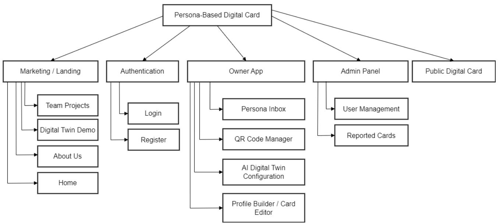

flowchart

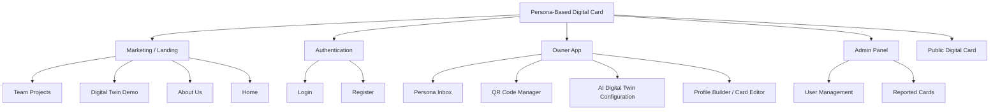

Sơ đồ cây trang của hệ thống

Hình trên thể hiện sơ đồ cây điều hướng của hệ thống Persona-Based Digital Card. Các màn hình được chia thành các nhóm chính gồm Marketing / Landing, Authentication, Owner App, Admin Panel và Public Digital Card. Phần lớn các trang trong hệ thống được đặt ở cùng một cấp điều hướng vì phạm vi MVP chưa có nhiều luồng con phức tạp hoặc trang chi tiết sâu hơn. Cách tổ chức này giúp người dùng dễ nhận biết các khu vực chức năng chính và hỗ trợ quá trình demo hệ thống rõ ràng hơn.

# 4. Landing page giới thiệu demo

Mục tiêu: giới thiệu nhóm, mô tả nền tảng công nghệ, show project seminar và dẫn người dùng tới phần demo Digital Twin. Đây là lớp marketing/trình bày đồ án, không phải dashboard quản trị.

# 4.1. Bố cục đề xuất

● Header sticky: logo SEMINAR bên trái, menu About/Team Projects/Digital Twin/Contact bên phải.   
● Hero section dùng headline lớn, ảnh/team card chồng lớp, thông tin “Since 2026”.   
● Section công nghệ dùng card xanh bo góc, tag như AI Agent, Firebase/Supabase, Motion Graphic, Digital Twin AI Chat.   
● Section team dùng grid ảnh chân dung bo góc; click vào thành viên mở Digital Twin demo tương ứng.   
● Footer/contact dùng nền xanh brand, headline lớn, form email đơn giản và icon social.

# 4.2. Thành phần giao diện

Bảng 7 Bảng thành phần giao diện landing page

<table><tr><td>Component</td><td>Mô tả / Quy tắc hiển thị</td></tr><tr><td>Header</td><td>Logo SEMINAR, navigation, active pill. Trên mobile chuyển thành menu icon.</td></tr><tr><td>Hero</td><td>Headline lớn, ảnh dạng polaroid/card, mô tả project ngắn.</td></tr><tr><td>Tech Stack Card</td><td>Nền xanh, text trắng, tag pill trắng/xanh; trình bày nền tầng công nghệ của team.</td></tr><tr><td>Team Gallery</td><td>Ảnh thành viên và nhân vật AI demo; click dẫn đến Digital Twin tương ứng.</td></tr><tr><td>Contact Form</td><td>Input email/nội dung, nút Send, validate email trước khi gửi.</td></tr></table>

# 4.3. Tương tác và trạng thái

● Click nav cuộn đến section tương ứng hoặc chuyển page.   
● Click “Chat with Digital Twin” mở trang /digital-twin hoặc modal chọn thành viên để chat.   
● Hover project/team card: nâng nhẹ, hiện overlay/tên/role.   
● Submit contact: toast thành công hoặc lỗi email không hợp lệ.   
● Cần thiết kế loading skeleton cho ảnh team, empty/error project list và layout mobile một cột.

# OUR WORK

  
Workshop Copilot

01.2026 - 02.2026

pnatibusagisis paurontesascturuusus.Donecquaisriciesnepesqueuptiumuis,sem. ulla consequat messa quis enm

PYTHON

01.2026 - 02.2026

ulla consequat massa quis enm

PYTHONNENDIEYA

  
Cơ s lp trình vi GenAI

PYTHONGENA

  
Nâng cao lp trình vói GenAl

01.2026 - 02.2026

pentibusaotscurussDonecquaesn pequeptumu. Nulla consequat massa quis enim

(PYTHON)(GENA)

  
Xây dng sn phm phn mm dùng GenAl

01.2026 - 02.2026

patibusai psasrs quaciesnesque. lor sit amet, consectetuer adipiscing elit. Aenean Na bus et mat mis d quis enim

PYTHONGENA

  
PERSONAL WEBSITE WITH AN AI DIGITAL TWIN

paus a sseques qu

PYTHONGENA

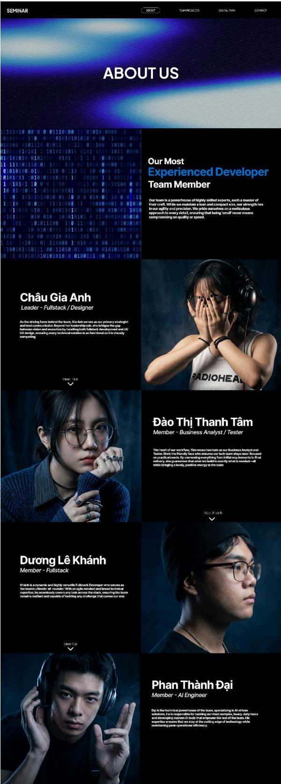

text_image

SEMINAR
ABOUT
TEAM PROJECTS
DIGITAL TWN
CONTACT
ABOUT US
Our Most
Experienced Developer
Team Member
Our team is a powerhouse of highly skilled experts, each a master of their craft. While we maintain a lean and compact size, our strengths lies in our agility and precision. You provide ourselves on a multicultural approach to every detail, ensuring that being 'unself' never means compromising on quality or speed.
Châu Gia Anh
Leader - Fullstack / Designer
As the driving force behind the team, Gia Anh serves as our primary straight and head circumference. Beyond her husbandhood rule, she believes that they between vision and execution by handling both fullstack development and AI/IO design, en matching every technical solution to an functional as it is vitrally competing.
Maree: Kim
Đào Thị Thanh Tâm
Member - Business Analyst / Tester
The heart of our workflow, Tâm wears two hate as our Business Analyst and Tester. She's the friendly face who ensures our tech team stays later focused on practical events. By revealing everything from what people know is final delivery, she guarantees that when we huddle is exactly what is needed—all who bring it lovely, positive energy to the team.
Vazz: Khanh
Dương Lê Khánh
Member - Fullstack
Khuk is a dynamic and highly versatile Fullstack Developer who serves as the team's unique all "chuanh" with an eight member and tenor for More capital, he successfully covers any task across the stack, ensuring the team’s remite resilient and capable of tackling any challenge that comes our way.
Lee Li
Phan Thành Đại
Member - AI Engineer
Đai is the technical powerhouses of the team, specializing in AI-driven solutions, he is responsible for tailoring our most complex, heavy-any tasks and developing custom. It looks that improves the rest of the team. It experiences ensures that we stay at the cutting edge of technology while maintaining peak operational efficiency.

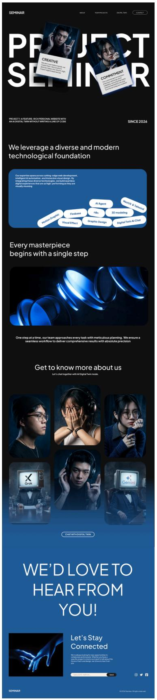

text_image

SEMINAR
ABOUT
COMPRECISES
DECIMAL TRAIN
CONTACT
PROJECT SEMINAR
CREATIVE
We can use a digital twin without writing a line of code
COMMITMENT
On the project's ability to create a new AI tool in creating a new AI tool. We will be able to create a new AI tool in creating a new AI tool. We will also create a new AI tool in creating a new AI tool. We will also create a new AI tool in creating a new AI tool. We will also create a new AI tool in creating a new AI tool. We will also create a new AI tool in creating a new AI tool. We will also create a new AI tool in creating a new AI tool. We will also create a new AI tool in creating a new AI tool. We will also create a new AI tool in creating a newAI Tool. 
SINCE 2026
We leverage a diverse and modern technological foundation
Our expertise spans across cutting-edge web development, which is used to create a diverse and modern technological foundation. We build a multi-level AI tool with a single step.
Hellen Graphics
Firebase
nbn
3D modeling
Visual Effect
Graphic Design
Digital Twin AI Chat
Every masterpiece begins with a single step
One step at a time, our team approaches every task with meticulous planning. We ensure a seamless workflow to deliver comprehensive results with absolute precision
Get to know more about us
Let's chat together with AI Digital Twin models.
X Grok
Gems
COMT WITH DIGITAL TWINS
WE'D LOVE TO HEAR FROM YOU!
Let's Stay Connected
SEMINAR
© 2024 Seminar © 2024 Seminar

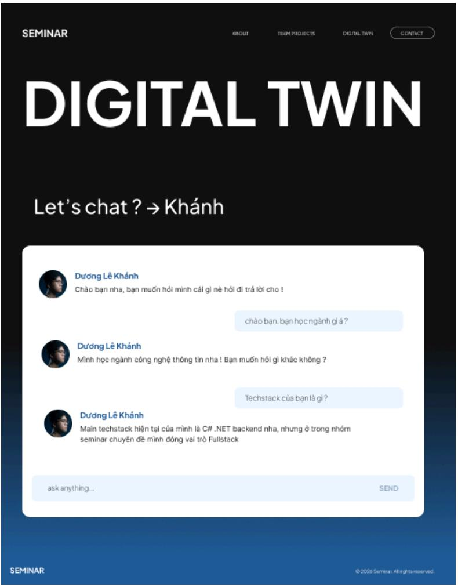

text_image

SEMINAR
ABOUT
TEAM PROJECTS
DIGITAL TWIN
CONTACT
DIGITAL TWIN
Let's chat ? → Khánh
Dương Lê Khánh
Chào bạn nha, bạn muốn hỏi mình cái gì nè hôi di trả lời cho !
chào bạn, bạn học ngành giá ?
Dương Lê Khánh
Minh học ngành công nghệ thông tin nha ! Bạn muốn hỏi gì khác không ?
Techstack của bạn là gì ?
Dương Lê Khánh
Main techstack hiện tại của mình là C# .NET backend nha, nhưng ở trong nhóm seminar chuyên đề mình đóng vai trò Fullstack
ask anything...
SEND
SEMINAR
© 2026 Seminar: All rights reserved.

Hình 1 Giao diện landing page giới thiệu demo

# 5. Public Digital Profile

Trang hồ sơ công khai là nơi khách mở sau khi quét QR hoặc bấm URL cá nhân hóa dạng digitalcard.app/u/[username]. Mục tiêu là xem nhanh chủ thẻ là ai, có kỹ năng/dự án gì, liên hệ ra sao, lưu danh bạ và bắt đầu chat với AI đại diện. Ngoài ra cũng có Khung chat cho phép khách hỏi AI đại diện của chủ thẻ về kinh nghiệm, dự án hoặc dịch vụ. UI phải tạo cảm giác đang nói chuyện với trợ lý AI của chủ thẻ, không gây hiểu nhầm AI là người thật.

# 5.1. Bố cục đề xuất

● Mobile-first: cover, avatar, tên, role, slogan, CTA nằm trong màn đầu.   
● Desktop: layout 2 cột; trái là profile summary, phải là chat entry/project preview.   
● Section chính: Hero Profile, Social Links, About/Bio, Skills, Featured Projects, Save Contact, Contact Form.   
● Nếu card đang Draft hoặc bị khóa, public route không hiển thị hồ sơ dở dang mà chuyển sang 404/thông báo đang cập nhật.

# 5.2. Thành phần giao diện

Bảng 8 Bảng thành phần giao diện Public Digital Profile

<table><tr><td>Component</td><td>Mô tả / Quy tắc hiển thị</td></tr><tr><td>Cover + Avatar</td><td>Ảnh bìa 16:9/21:9, avatar tròn hoặc bo góc; nếu thiếu ảnh dùng gradient placeholder.</td></tr><tr><td>Name + Verified Badge</td><td>Tên lớn, chức danh, tick verified nếu đăng nhập Google/dã xác thực.</td></tr><tr><td>Social Icon Buttons</td><td>Facebook, Instagram, X, GitHub, Behance, Dribbble, Portfolio, Email; ăn nếu user không khai báo.</td></tr><tr><td>Save Contact CTA</td><td>Nút “Lưu liên lạc” tạo file .vcf; chỉ đưa email/SĐT vào VCF nếu quyền riêng tư cho phép.</td></tr><tr><td>AI Chat Entry</td><td>Nút/widget “Ask my AI Twin” với trạng thái AI Ready/Disabled/Error.</td></tr><tr><td>Static Contact Form</td><td>Form dự phòng khi AI lỗi/tắt hoặc khách muốn gửi tin nhân thủ công; bắt buộc có consent.</td></tr></table>

# 5.3. Tương tác và trạng thái

● Bấm social icon mở link ở tab mới.   
● Bấm Save Contact tải file VCF chuẩn vCard 3.0 và ghi nhận event tracking.   
● Bấm Chat mở khung Digital Twin chat trong cùng trang.   
● Submit form hiển thị consent “Bằng cách gửi thông tin, bạn đồng ý cho chủ thẻ liên hệ lại”.   
Trạng thái cần có: 404, hồ sơ đang cập nhật, card bị khóa, AI Disabled, AI Error, skeleton khi tải profile.

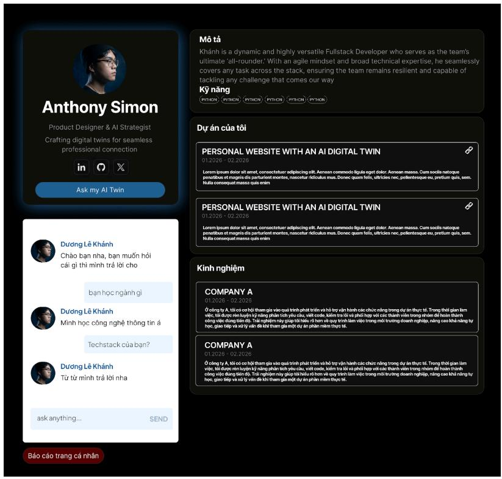

text_image

Anthony Simon
Product Designer & AI Strategist
Crafting digital twins for seamless
professional connection
in
Ask my AI Twin

Dudong Lê Khánh
Chào ban nha, ban muốn hói
cái gì thi minh trả lời cho

Dudong Lê Khánh
Minh học công nghệ thông tin á

Techstack của bạn?

Dudong Lê Khánh
Từ từ minh trả lời nha

ask anything...
SEND

Mô tả
Khánh is a dynamic and highly versatile Fullstack Developer who serves as the team's
ultimate 'all-rounder: With an agile mindset and broad technical expertise, he seamlessly
covers any task across the stack, ensuring the team remains resilient and capable of
tackling any challenge that comes our way
Kỹ năng
(PITCH)
(PITCH)
(PITCH)
(PITCH)
(PITCH)
(PITCH)

Dự án của tối

PERSONAL WEBSITE WITH AN AI DIGITAL TWIN
01.2026 - 02.2026

Lorem ipsum-sizeir sit amet, connectebular adipiscing síti. Aenean commodo liguta eget daker. Aenean massa. Cum sociol natoque
pensitius et magnita dis parturiant montes, nasceitar léticulus mus. Donec quam felis, ultricies nec, pentaertisque eu, pretium quis, sem.
Nulta consequat massa quis smàn

PERSONAL WEBSITE WITH AN AI DIGITAL TWIN
01.2026 - 02.2026

Lorem ipsum-sizeir sit amet, connectebular adipiscing síti. Aenean commodo liguta eget daker. Aenean massa. Cum sociol natoque
pensitius et magnita dis parturiant montes, nasceitar léticulus mus. Donec quam felis, ultricies nec. pentaertisque eu, pretium quis, sem.
Nulta consequat massa quis smàn

Kinh nghiệm

COMPANY A
01.2026 - 02.2026

Ó công ty A, lôi có có có them gia vivot qua trình phát triển và hỗ trợ văn hành các chức Scandin trong dự án thực tế. Trong thế given làm
voc, từ được đản Scandinทาง facilities you處, và cơe, kiểm<|vision_start|> co rủ la và photodi fog et cản Scandin trong Prague đểほin thanh
cong việc dụng tiêu diu. Trai nghiệm máy giúp/tá hídú rõ hơn và quy trình làm việc trong môi trường doanh nghiệp, Scandin cao khả năng tự
học, giáo tiếp và xử lý và đi-kil them gia mMỊ vụ an phân mềm thực tế.

COMPANY A
01.2026 - 02.2026

Ó công ty A, lôi có có có them gia vivot qua trình phát triển và hỗ trợ văn hành các chức Scandin trong dự án thực tế. Trong thế given làm
voc, từ được đản Scandinทาง facilities you處, và cơe, kiểm có rủ la và quy trình hợp et cản Scandin trong Prague đểほin thanh
cong việc ScandinOLID Diu. Trai nghiệm máy giúp/tá hídú rõ hơn và quy trình làm việc trong môi trường doanh nghiệp, Scandin cao khả năng tự
học, giáo tiếp và xử lý và đi-kil them gia mMỊ vụ an phân mềm thực tế.

Bảo cáo trang cá nhân

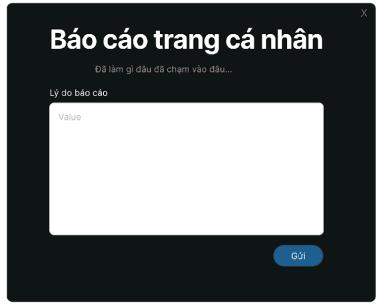

text_image

Báo cáo trang cá nhân
Dã lâm gì dấu đã chàm vào dấu...
Lý do báo cáo
Value
Gùi

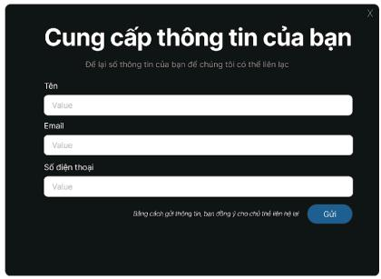

text_image

Cung cấp thông tin của bạn
Déi lại số thông tin của bạn để chứng tối có thể liên lực
Tên
Value
Email
Value
Số điện thoại
Value
Bình phần provides information, bus zhòng y无需 chất<|vision_start|> Lesin trị!

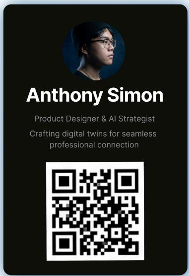

text_image

Anthony Simon
Product Designer & AI Strategist
Crafting digital twins for seamless
professional connection

Hình 2 Giao diện Public Profile , chat preview, report form, lead form và contact save

# 6. Dashboard dành cho chủ thẻ

# 6.1. Profile Builder / Card Editor

Màn hình để chủ thẻ nhập thông tin cá nhân, social links, quyền riêng tư, template và preview realtime trước khi xuất bản.

● Desktop: form bên trái, live preview bên phải.   
● Mobile: form theo từng step; preview mở bằng nút “Xem trước”.   
● Nhóm form: Basic Info, Media, Social Links, Privacy, Theme, Publish.   
● Preview realtime cập nhật dưới 200ms theo yêu cầu NFR.

Bảng 9 Bảng thành phần Profile Builder / Card Editor 

<table><tr><td>Component</td><td>Mô tả / Quy tắc hiễn thị</td></tr><tr><td>Basic Info Form</td><td>Họ tên, chức danh, slogan, bio tối đa 300 ký tự, slug.</td></tr><tr><td>Media Upload</td><td>Avatar, cover; avatar tối đa 5MB; crop/preview trước khi lưu.</td></tr><tr><td>Social Links</td><td>URL input có validate định dạng; icon tự động hiện nếu có dữ liệu.</td></tr><tr><td>Privacy Toggles</td><td>Ăn/hiện email, số điện thoại; ảnh hưởng cả public UI, VCF và dữ liệu AI được phép biết.</td></tr><tr><td>Theme Selector</td><td>Chọn dark/blue template, font, accent color nhưng vẫn trong hệ màu brand.</td></tr><tr><td>Live Preview</td><td>Mô phỏng public profile theo kích thước mobile/desktop.</td></tr></table>

● Auto-save draft hoặc Save Draft.   
● Publish kiểm tra trường bắt buộc.   
● Slug trùng báo lỗi ngay.   
Trạng thái: validation error, upload failed, slug unavailable, draft saved, published successfully.

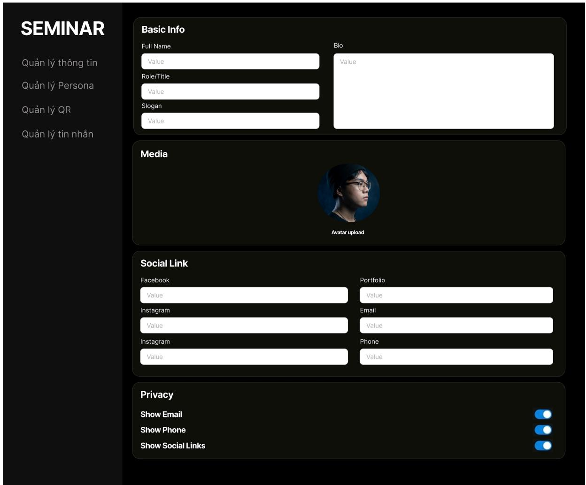

text_image

SEMINAR
Quản lý thông tin
Quản lý Persona
Quản lý QR
Quản lý tin nhân
Basic Info
Full Name
Value
Role/Title
Value
Slogan
Value
Bio
Value
Media
Avatar upload
Social Link
Facebook
Value
Instagram
Value
Instagram
Value
Portfolio
Value
Email
Value
Phone
Value
Privacy
Show Email
Show Phone
Show Social Links

Hình 3 Hình tham chiếu Profile Builder / Card Editor.

# 6.2. AI Digital Twin Configuration

Màn hình cấu hình tone, system prompt, Knowledge Base Form và guardrails để AI trả lời đúng persona của chủ thẻ. Theo PRD, không thiết kế upload PDF/DOCX; mọi tri thức đều nhập bằng form có cấu trúc và backend tổng hợp thành persona\_data.json.

● Dùng tab/accordion: Persona, Knowledge Base, Prompt Rules, Test Chat, Publish AI.   
● Hiển thị thanh trạng thái AI: Draft, AI Ready, AI Disabled, AI Error.   
● Có khung Test Chat nội bộ để owner thử câu hỏi trước khi public.   
● Có cảnh báo: AI chỉ trả lời dựa trên dữ liệu đã nhập và không tự bịa thông tin.

<table><tr><td>Component</td><td>Mô tả / Quy tắc hiển thị</td></tr><tr><td>Tone Selector</td><td>Chuyên nghiệp, thân thiện, hài hướng, ngắn gọn; có mô tả từng tone.</td></tr><tr><td>System Prompt Box</td><td>Textarea tối đa 2.000 ký tự; counter; cảnh báo không nhập thông tin nhạy cảm.</td></tr><tr><td>Knowledge Base Form</td><td>Kỹ năng, kinh nghiệm, dự án, dịch vụ, FAQ; backend gom thành persona data.json.</td></tr><tr><td>Guardrail Checklist</td><td>Không bịa thông tin, không báo giá nếu chưa có, luôn xưng “Trợ lý AI của [Tên]”.</td></tr><tr><td>Test Chat</td><td>Chat thử nội bộ với nút regenerate/reset conversation.</td></tr><tr><td>AI Toggle</td><td>Bật/tắt AI public; nếu tắt thì public card hiển thị fallback form.</td></tr></table>

● Lưu và huấn luyện AI.   
● Test prompt trước khi publish.   
● Bật/tắt AI với confirm modal.   
● Hiển thị lỗi nếu System Prompt vượt 2.000 ký tự hoặc tổng dữ liệu JSON vượt 15.000 ký tự.   
● Trạng thái cần thiết kế: AI Draft, AI Training, AI Ready, AI Error, AI Disabled, Prompt too long.

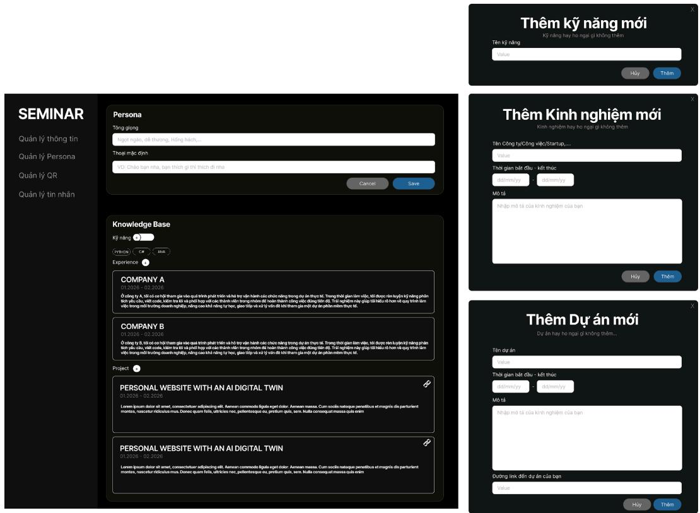

text_image

SEMINAR
Quản lý thông tin
Quản lý Persona
Quản lý QR
Quản lý tin nhân
Persona
Tổng giống
Ngot ngale, ciki thương, Hồng háchi...
Thoại mặc định
VD: Cháo ban nha, ban thích gi thể thích di nha
Cancel Save
Knowledge Base
Kỹ năng
(m/m²)
Experience
COMPANY A
01.2026 - 02.2026
Ó công ty, B, t&I do cơ sở them gia viào quì them phát triển và hồ trợ viàn hành các choic năng trong dự án thực tế. Trong thôi glan làm việc, mì diuòc rén kuyén kỹ năng phần t&I provides, Cork cada, kitiang cói fiscal hợp và cai dhihine vigo trong omni diu, hǎo thôi cong Cape, Dàmmíyú. T&I amélien ng粒 g让 Náu cói huàn cói qay trich lam vigo trong môi bùtung doanh ngájón, răng cαo khí năng tuýt, gao lifig và uǐ yīn diu kiti them gia môi duý an phân mònm thy sě.
COMPANY B
01.2026 - 02.2026
Ó công ty B, t&I do cơ sở them gia viào quì them phát triển và hồ trợ viàn hành các choic năng trong dự án thực tế. Trong thôi glan làm việc, t&I ducó rén kuyén kỹ năng phần t&I provides, Cork cada, kitiang cói fiscal hợp và cai dhihine vigo trong omni diu, hǎo thôi cong Cape, Dàmmíyú. T&I amélien ng粒 g让 Náu cói huàn cói qay trich lam vigo trong môi bùtung doanh ngájón, răng c αo khí năng tuýt, gao lifig và uǐ yīn diu kiti them gia môi duý an phân mònm thy sě.
Project
PERSONAL WEBSITE WITH AN AI DIGITAL TWIN
01.2026 - 02.2026
Lorem ipsum dolor at smet, connecteur adjusting eifi, Annuen comodo ligale esgt color, Annuen massa, Cum socié natique janniticus et magnés de parturant monter, nasceitur didiscus mud. Hence quam felis, atrifices nec, pententesque du, pretium quis, sem. Nulle consequat massa què enm
PERSONAL WEBSITE WITH AN AI DIGITAL TWIN
01.2026 - 02.2026
Lorem ipsum dolor at smet, connecteur adjusting eifi, Annuen comodo ligale esgt color, Annuen massa, Cum socié natique janniticus et magnés de parturant monter, nasceitur didiscus mud. Hence quam felis, atrifices nec, pententesque ou, pretium quis, sem. Nulle consequat massa què enm
Thêm kỹ năng mới
Tên kỹ năng
Value
Hủy Thêm
Thêm Kinh nghiệm mới
Kinh nghiệm hay ho ngai gi không thêm
Tên Cống ty/Công việc/Startup...
Value
Thời gian bất dibu - kết thúc
dàmmíyú  dàmmíyú
Mô tả
Nhập mô tả của kinh nghiệm của ban
Hủy Thêm
Thêm Dự án mới
Dự án hay ho ngai gi không thêm...
Tên dự án
Value
Thời gian bất dibu - kết thúc
dàmmíyú  dàmmíyú
Mô tả
Nhập mô tả của kinh nghiệm của ban
Dương link đến dự án của ban
Value
Hủy Thêm

Hình 4 Hình tham chiếu AI Digital Twin Configuration.

# 6.3. QR Code Manager

Màn hình quản lý QR giúp chủ thẻ lấy mã QR duy nhất trỏ đến public Digital Profile. QR dùng cho demo, in danh thiếp hoặc dán vào poster/slide.

● Card trung tâm hiển thị QR lớn, URL slug và nút copy link.   
● Nút tải PNG/SVG rõ ràng; PNG tối thiểu 1000x1000px.   
● Preview màu QR có thể đồng bộ brand xanh/đen nhưng phải đủ contrast để camera quét.   
● Nếu slug đổi, hệ thống cảnh báo QR cũ có thể không còn đúng.

<table><tr><td>Component</td><td>Mô tả / Quy tắc hiển thị</td></tr><tr><td>QR Preview</td><td>Mã QR lớn, có padding/quiet zone đủ rộng.</td></tr><tr><td>Copy URL</td><td>Copy slug cá nhân hóa dạng digitalcard.app/u/[username].</td></tr><tr><td>Download PNG/SVG</td><td>Tải file phục vụ in ấn và demo.</td></tr><tr><td>Tracking Hint</td><td>Gọi ý ràng lượt scan/click sẽ được ghi nhận vào Basic Analytics.</td></tr></table>

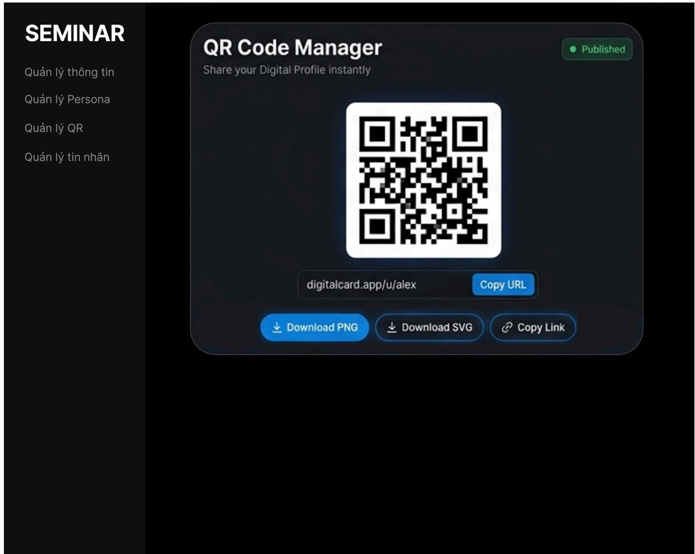

text_image

SEMINAR
QUẢN LÝ thông tin
QUẢN LÝ Persona
QUẢN LÝ QR
QUẢN LÝ tin nhẫn
QR Code Manager
Share your Digital Profile instantly
Published
digitalcard.app/u/alex
Copy URL
Download PNG
Download SVG
Copy Link

Hình 5 Hình tham chiếu ví lưu trữ QR

# 6.4. Persona Inbox & Human Takeover

Persona Inbox là nơi chủ thẻ xem lịch sử chat, lead đã thu thập và xử lý hội thoại quan trọng. Human Takeover cho phép chủ thẻ tạm dừng AI để trực tiếp nhắn với khách.

● Desktop: layout 3 cột gồm danh sách hội thoại, nội dung chat, panel thông tin lead.   
● Mobile: danh sách hội thoại -> detail chat -> lead drawer.   
● Mỗi hội thoại hiển thị tên khách nếu có, thời gian, nguồn, trạng thái AI/Human, tag lead.   
● Nút Human Takeover đặt rõ nhưng cần confirm để tránh bấm nhầm.

Bảng 11 Bảng thành phần Persona Inbox & Human Takeover 

<table><tr><td>Component</td><td>Mô tả / Quy tắc hiễn thị</td></tr><tr><td>Conversation List</td><td>Tên khách/ẩn danh, thời gian, trạng thái unread, nguồn QR/link/form.</td></tr><tr><td>Transcript Viewer</td><td>Tin nhấn khách, AI và owner được phân màu rõ.</td></tr><tr><td>Lead Panel</td><td>Tên, email, SĐT, nhu cầu hợp tác, consent status.</td></tr><tr><td>Human Takeover Toggle</td><td>Bật takeover thì AI tạm ngừng cho phiên đó; có banner thông báo cho khách.</td></tr><tr><td>Actions</td><td>Mark read/unread, archive, delete, email notification.</td></tr></table>

● Click hội thoại mở transcript.   
● Takeover tắt AI cho phiên đó.   
Gửi tin owner realtime.   
● Archive/xóa có confirm.   
● Trạng thái cần thiết kế: live conversation, guest offline, AI paused, unread, archived, lead captured.

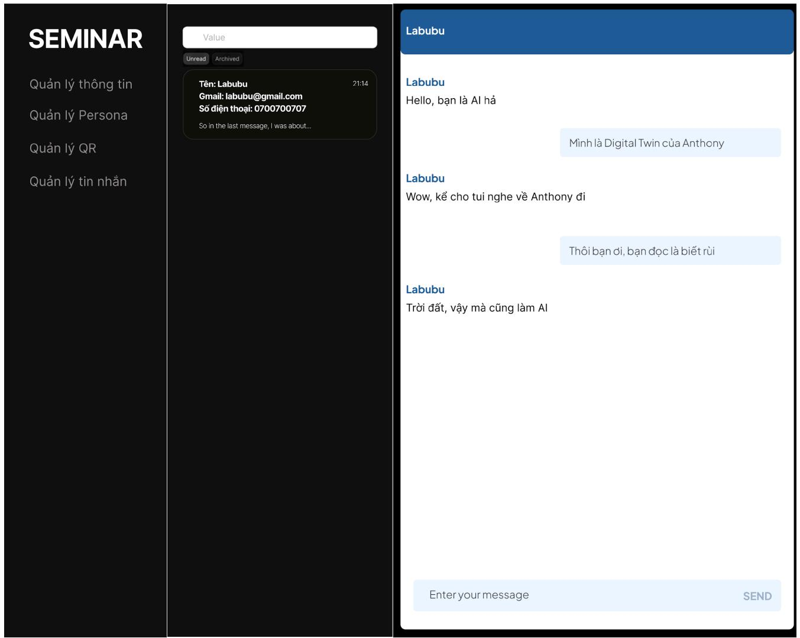

text_image

SEMINAR
Quản lý thông tin
Quản lý Persona
Quản lý QR
Quản lý tin nhân

Value
Unread Archived
Tên: Labubu
Gmail: labubu@gmail.com
Số điện thoại: 0700700707
So in the last message, I was about...

Labubu
Hello, bạn là Al há

Mình là Digital Twin của Anthony

Labubu
Wow, kể cho túi nghe về Anthony đi

Thôi bạn đi, bạn đọc là biết rủi

Labubu
Trời đất, vậy mà cũng làm Al

Enter your message SEND

Hình 6 Hình tham chiếu Persona Inbox / quản lý tin nhắn.

# 7. Admin Panel

Admin Panel là khu vực dành cho quản trị viên dùng để quản lý tài khoản người dùng và xử lý các trường hợp người dùng bị báo cáo. Giao diện được thiết kế theo phong cách tối, đồng bộ với hệ thống chính, sử dụng bố cục sidebar bên trái và vùng nội dung quản lý ở bên phải.

Admin Panel hiện gồm 2 chức năng chính:

● Quản lý người dùng   
Quản lý báo cáo

Sidebar chỉ hiển thị các mục quản trị cần thiết, tránh đưa vào các chức năng không nằm trong phạm vi đồ án như analytics nâng cao, AI usage chart, settings hệ thống hoặc quản lý template.

# 7.1. Quản lý người dùng

Trang Quản lý người dùng cho phép admin xem danh sách tài khoản đã đăng ký trong hệ thống. Dữ liệu được trình bày dưới dạng bảng để dễ theo dõi, tìm kiếm và thao tác quản trị.

Bảng quản lý người dùng bao gồm các thông tin chính:

<table><tr><td>Thành phần</td><td>Mô tả / Quy tắc hiển thị</td></tr><tr><td>ID tài khoản</td><td>Mã định danh của người dùng trong hệ thống.</td></tr><tr><td>Tên đầy đủ</td><td>Hiển thị họ tên người dùng.</td></tr><tr><td>Email</td><td>Email đăng ký tài khoản.</td></tr><tr><td>Ngày đăng ký</td><td>Ngày người dùng tạo tài khoản.</td></tr><tr><td>Trạng thái xác thực</td><td>Hiển thị trạng thái như “Đã xác thực” hoặc “Đã khóa”.</td></tr><tr><td>Thao tác quản lý</td><td>Cho phép admin xem thông tin, khóa/mở khóa tài khoản hoặc truy cập thao tác liên quan.</td></tr></table>

Trang có ô tìm kiếm nhanh để admin có thể tìm người dùng theo email, tên hoặc trạng thái tài khoản. Bảng dữ liệu hỗ trợ phân trang để phù hợp khi số lượng người dùng lớn.

Các thao tác quan trọng như khóa hoặc mở khóa tài khoản cần có xác nhận trước khi thực hiện để tránh thao tác nhầm.

# 7.2. Quản lý báo cáo

Trang Quản lý báo cáo dùng để admin theo dõi danh sách người dùng bị báo cáo bởi người khác. Mục tiêu của trang này là giúp admin kiểm tra lý do báo cáo và đưa ra hướng xử lý phù hợp.

Bảng quản lý báo cáo bao gồm các thông tin chính:

<table><tr><td>Thành phần</td><td>Mô tả / Quy tắc hiện thị</td></tr><tr><td>ID tài khoản</td><td>Mã tài khoản của người dùng bị báo cáo.</td></tr><tr><td>Tên đầy đủ</td><td>Tên người dùng bị báo cáo.</td></tr><tr><td>Email</td><td>Email của tài khoản bị báo cáo.</td></tr><tr><td>Trạng thái xác thực</td><td>Cho biết tài khoản hiện đang hoạt động, đã xác thực hoặc đã bị khóa.</td></tr><tr><td>Lý do bị báo cáo</td><td>Hiển thị nguyên nhân người dùng bị report, ví dụ: quấy rối, nội dung không phù hợp, tài khoản giả mạo, vi phạm điều khoản.</td></tr><tr><td>Ngày tạo</td><td>Thời điểm báo cáo được tạo.</td></tr><tr><td>Thao tác quản lý</td><td>Cho phép admin xem chi tiết, xử lý báo cáo hoặc khóa/mở khóa tài khoản liên quan.</td></tr></table>

Trang có thanh tìm kiếm nhanh để lọc báo cáo theo email, tên, trạng thái hoặc lý do báo cáo. Các báo cáo được hiển thị theo dạng bảng nhằm giúp admin dễ so sánh và xử lý nhiều trường hợp cùng lúc.

# 7.3. Trạng thái và quy tắc hiển thị

Admin Panel cần thiết kế các trạng thái giao diện cơ bản để hỗ trợ quá trình sử dụng:

● Loading: hiển thị khi bảng đang tải dữ liệu.   
● No data: hiển thị khi chưa có người dùng hoặc chưa có báo cáo nào.   
● Permission denied: hiển thị khi tài khoản không có quyền truy cập Admin Panel.   
● Confirm action: hiển thị hộp xác nhận khi admin khóa hoặc mở khóa tài khoản.   
● Report resolved: hiển thị trạng thái báo cáo đã được xử lý.

# 7.4. Nguyên tắc thiết kế

Admin Panel sử dụng giao diện tối để đồng bộ với phong cách tổng thể của hệ thống. Sidebar đặt bên trái, nội dung chính hiển thị trong khung lớn bên phải. Các bảng dữ liệu cần rõ ràng, dễ đọc, có khoảng cách hợp lý giữa các cột và dùng màu trạng thái để phân biệt tài khoản đang hoạt động, đã xác thực hoặc đã bị khóa.

Các chức năng ngoài phạm vi như thống kê nền tảng, biểu đồ AI usage, quản lý card nâng cao hoặc settings hệ thống không được đưa vào giao diện admin trong phiên bản hiện tại.

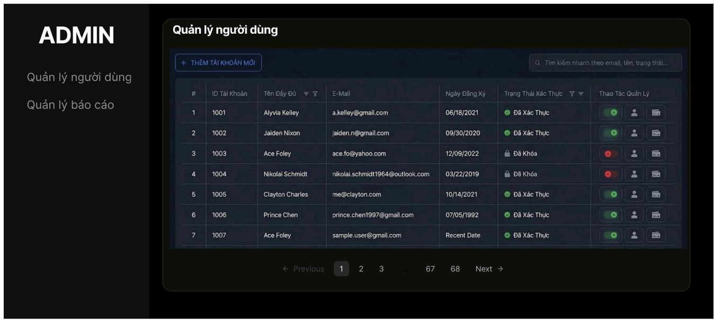

text_image

ADMIN
Quản lý người dùng
+ THÊM TÀI KHỒN MỐI
Quản lý người dùng
Quản lý báo cáo
# ID Tài Khoản    Tên Dếy Đù    E-Mail    Ngày Đăng Kỳ    Trạng Thái Xác Thực    Thao Tác Quản Lý
1 1001    Alyvia Kelley    a.kelley@gmail.com    06/18/2021    Đã Xác Thực
2 1002    Jaiden Nixon    jaiden.n@gmail.com    09/30/2020    Đã Xác Thực
3 1003    Ace Foley    ace.fo@yahoo.com    12/09/2022    Đã Khóa
4 1004    Nikolai Schmidt    nikolai.schmidt1964@outlook.com    03/22/2019    Đã Khóa
5 1005    Clayton Charles    me@clayton.com    10/14/2021    Đã Xác Thực
6 1006    Prince Chen    prince.chen1997@gmail.com    07/05/1992    Đã Xác Thực
7 1007    Ace Foley    sample.user@gmail.com    Recent Date    Đã Xác Thực
← Previous  1  2  3 ...  67  68  Next →

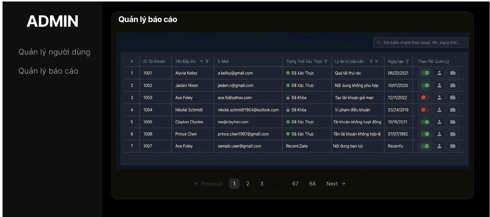

text_image

ADMIN
Quản lý người dùng
Quản lý báo cáo
# ID Tài Khoản
Tên Đầy Dù
E-Mail
Trạng Thái Xác Thực
Lý do bị báo cáo
Ngày tạo
Thao Tác Quản Lý
1 1001
Alyvia Kelley
a.kelley@gmail.com
Đã Xác Thực
Quá tải thứ rác
06/20/2021
2 1002
Jaiden Nixon
jaiden.n@gmail.com
Đã Xác Thực
Nội dung không phù hợp
10/01/2020
3 1003
Ace Foley
ace.fo@yahoo.com
Đã Khóa
Tạo tài khoản giả mạo
12/11/2022
4 1004
Nikolai Schmidt
nikolai.schmidt1964@outbook.com
Đã Khóa
Vị phạm điều khoản
03/24/2019
5 1005
Clayton Charles
me@clayton.com
Đã Xác Thực
Tài khoản không hoạt động
10/16/2021
6 1006
Prince Chen
prince.chen1997@gmail.com
Đã Xác Thực
Tên tài khoản không hợp lệ
07/07/1992
7 1007
Ace Foley
sample.user@gmail.com
Recent Date
Nội dung bạo lực
Recently

Hình 7 Hình tham chiếu admin quản lý user / report card

# 8. Trạng thái hệ thống và fallback

Phần này được bổ sung để tài liệu GUI khớp với PRD. Mỗi trạng thái cần có biểu hiện UI rõ ràng, tránh để khách nhìn thấy trang trống hoặc lỗi kỹ thuật.

Bảng 13. Bảng giao diện trạng thái AI

<table><tr><td>Trạng thái</td><td>Ý nghĩa</td><td>Hành vi giao diện</td></tr><tr><td>Draft</td><td>Card/Profile hoặc AI đang nhập liệu, chưa hoàn thiện.</td><td>Public URL trả về 404 hoặc thông báo “Hồ sơ đang được cập nhật”. QR chưa nên public.</td></tr><tr><td>Published</td><td>Card đã xuất bản và hiển thị thông tin tỉnh.</td><td>Khách quét QR xem được avatar, bio, social, Save Contact và form/contact.</td></tr><tr><td>AI Disabled</td><td>Card vẫn Published nhưng chủ thể tắt chatbot.</td><td>Ăn chat widget, hiển thị Fallback Form để khách để lại lời nhân.</td></tr><tr><td>AI Ready</td><td>AI đã có prompt và dữ liệu persona data.json hợp lệ.</td><td>Nút Chatbot sáng lên, tin nhân được gửi qua LLM, có typing state.</td></tr><tr><td>AI Error</td><td>Lỗi API/model/server hoặc JSON cấu hình.</td><td>Không hiện lỗi kỹ thuật. Chuyển sang thông báo bảo trì + fallback form, đồng thời báo owner/admin.</td></tr></table>

# Luồng fallback bắt buộc

● Nếu AI Disabled hoặc AI Error: public card hiển thị fallback form thay cho chat.   
● Nếu khách gửi form: validate email/SĐT, lưu lead vào Inbox và gửi email thông báo cho chủ thẻ.   
● Nếu AI bị hỏi ngoài knowledge base: trả lời chưa có thông tin, không bịa, gợi ý để lại liên hệ.   
● Nếu khách spam: áp dụng rate limit và thông báo nhẹ nhàng, không làm hỏng trải nghiệm người dùng bình thường.

# 9. Responsive Design

● Không dùng headline quá rộng khiến tràn màn hình mobile; clamp font-size bằng CSS clamp().   
● Public Profile, Save Contact và Chat phải dùng tốt trên màn hình điện thoại trước desktop.   
● Dashboard desktop có thể dùng sidebar, nhưng mobile phải chuyển thành bottom nav/menu drawer.   
● Form dài nên chia step/accordion để tránh cảm giác quá tải.   
● Chat input phải không bị bàn phím mobile che mất.   
● Ảnh/avatar cần lazy-load, skeleton và placeholder để đảm bảo public profile tải nhanh.

# 10. Accessibility & UX Rules

● Tương phản chữ/nền đủ cao, đặc biệt ở text xám trên nền đen.   
● Button/Link có label rõ, không chỉ dựa vào icon.   
● Form có label, helper text, error message gần trường nhập.   
● Modal cần focus trap, đóng bằng ESC, nút confirm/cancel rõ.   
● Animation tuân thủ prefers-reduced-motion.   
● Chat phải cho biết AI là trợ lý đại diện, không phải người thật.   
● Consent thu thập lead phải hiển thị gần input tên/SĐT/email.

# 11. Microcopy

Bảng 14. Bảng Microcopy của AI 

<table><tr><td>Tình huống</td><td>Microcopy đề xuất</td></tr><tr><td>AI ngoài knowledge base</td><td>Mình chưa có thông tin này trong hồ sơ của chủ thể. Bạn có thể để lại liên hệ để chủ thể phần hồi trực tiếp néhe.</td></tr><tr><td>AI Disabled</td><td>Chủ thể đang tạm tất AI. Bạn vẫn có thể để lại lời nhấn qua form bên dưới.</td></tr><tr><td>AI Error</td><td>Hiện tại AI đang bảo trì. Vui lòng để lại thông tin, chủ thể sẽ liên hệ lại sau.</td></tr><tr><td>Consent lead</td><td>Bằng cách gửi thông tin, bạn đồng ý cho chủ thể liên hệ lại về nội dung trao đổi này.</td></tr><tr><td>Save VCF success</td><td>Đã tải danh bạ. Bạn có thể mở file để lưu vào điện thoại.</td></tr><tr><td>Slug unavailable</td><td>Slug này đã được sử dụng. Vui lòng chọn một đường dẫn khác.</td></tr><tr><td>Prompt too long</td><td>Nội dung vượt quá giới hạn cho phép. Hãy rút gọn để AI xử lý ổn định hơn.</td></tr></table>

# 12. Bàn giao cho Frontend Developer

Bảng 15. Bảng các hạng mục cần bàn giao

<table><tr><td>Hạng mục</td><td>Yêu cầu bàn giao</td></tr><tr><td>Breakpoints</td><td>Mobile &lt; 768px, tablet 768-1024px, desktop &gt; 1024px.</td></tr><tr><td>Design tokens</td><td>Màu sắc, font size, spacing, radius, shadow, z-index cho modal/toast.</td></tr><tr><td>Component states</td><td>Default, hover, focus, disabled, loading, error, success.</td></tr><tr><td>Form validation</td><td>Required, URL invalid, email invalid, phone invalid, max length, slug duplicate.</td></tr><tr><td>AI states</td><td>Draft, Published, AI Disabled, AI Ready, AI Error, Training, Rate limited.</td></tr><tr><td>Analytics events</td><td>qr_scan, vcf_download, chat_started, message_sent, lead_captured, fallback_form_submitted.</td></tr><tr><td>Privacy logic</td><td>Email/SĐT chỉ hiện ở public UI, VCF và AI context khi owner cho phép.</td></tr></table>

# 13. Kết luận

Bản GUI Design hiệu chỉnh đã căn lại nội dung theo PRD mới: tập trung vào Digital Card + AI Digital Twin, Knowledge Base Form thay cho upload tài liệu, trạng thái AI/Card rõ ràng, fallback form bắt buộc, Persona Inbox + Human Takeover và basic analytics. Về hình ảnh, hướng dark-tech hiện tại vẫn phù hợp với landing page demo; phần cần sửa chủ yếu là wording, phạm vi tính năng và hành vi UI để không mâu thuẫn với PRD.